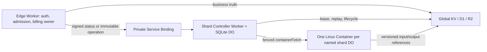

# Container Execution Plane Source Audit

Date: 2026-07-16

Status: local implementation evidence only. Go/VPS remains authoritative and
Cloudflare production is **NO-GO**.

## Scope

This document maps two independent source architectures into the native
cinatoken-rust execution plane:

- `C:\cinagroup\cinaVibeSDK` at `918e9748`: Cloudflare Worker, deterministic
  Durable Object/Container identity, lifecycle hooks, health probes, capacity,
  and rollout configuration;
- `C:\cinagroup\cinatoken`: Go relay admission, token authentication, model
  extraction, channel selection, pre-consume billing, retry ownership,
  settlement, and asynchronous task ownership.

Cloudflare's current platform guidance is also normative: use
[Service Bindings](https://developers.cloudflare.com/workers/runtime-apis/bindings/service-bindings/)
instead of public Worker-to-Worker HTTP, and use the
[Container class lifecycle](https://developers.cloudflare.com/containers/container-class/)
for DO-owned process startup, readiness, shutdown, and status hooks.

## Source Findings

### cinaVibeSDK patterns retained

1. `wrangler.jsonc` keeps the Container class name, DO binding class, and
   SQLite migration class aligned. cinatoken-rust preserves this triple for
   `RelayShardContainer`.
2. `worker/services/sandbox/sandboxSdkClient.ts` maps stable logical identity
   to a deterministic Sandbox/Container. cinatoken-rust uses canonical shard
   names and `getByName`, but replaces mutable modulo routing with Jump
   Consistent Hash plus a ring-generation fence.
3. `worker/services/browser-capture/sidecar-client.ts` separates a short health
   request from a longer business request. cinatoken-rust likewise separates a
   signed, 3-second, 4-KiB control-plane status probe from future operation
   execution.
4. `container/process-monitor.ts` distinguishes startup, running, graceful
   stop, forced termination, and repeated health failures. Equivalent facts
   belong in DO SQLite and lifecycle hooks, never only in memory timers.

### cinaVibeSDK patterns rejected

- Public URL plus bearer-token internal dispatch, route tokens written to logs,
  mutable `hash % max_instances`, overlapping `setInterval` recovery, infinite
  retries that outlive their caller, ephemeral disk as recovery truth, runtime
  config rewrites, production SSH, unpinned `latest` downloads, and a one-step
  100% Container rollout are not copied.
- `max_instances` is infrastructure capacity, not admission truth. The
  Controller separately enforces per-shard in-flight and ledger bounds.
- A process returning any HTTP response is not business readiness. `/healthz`
  means process liveness; `/readyz` must eventually prove initialized,
  non-draining operation acceptance.

### Go cinatoken authority retained

The original request path is explicit:

1. `router/relay-router.go:69-103` applies system checks, `TokenAuth`, model
   rate limits, and `Distribute` before `controller.Relay`.
2. `middleware/distributor.go:32-165` resolves requested model/group, affinity,
   enabled channel, model support, multi-key selection, mapping, override,
   base URL, and provider credentials.
3. `controller/relay.go:120-177` builds relay metadata, estimates tokens,
   freezes pricing, pre-consumes quota, and refunds a pre-provider failure.
4. `controller/relay.go:181-245` is the retry owner and selects a new eligible
   channel under explicit skip/retry policy.
5. `controller/relay.go:471-594` keeps task submit, billing settlement, durable
   task identity, pricing facts, and request/channel accounting linked.

These responsibilities remain in the edge Worker/D1 correctness spine. A shard
DO or Container may execute an already-admitted immutable operation, but it may
not authenticate users, choose billing groups, mutate quota independently,
invent a provider operation ID, or become a second retry owner.

## Target Four-Layer Contract

The Service Binding is capability-scoped transport, not authentication by
itself. Every control request also carries a short-lived HMAC authority token
bound to `kid`, issuer, audience, protocol, dispatch ID, method, path, and body
digest. Routing-key HMAC and controller authority use separate secrets.

## Implemented Edge-to-Controller Contract

- Root `wrangler.toml` declares `CONTAINER_CONTROLLER` separately for local,
  staging, and production. The target names exactly match the isolated
  Controller configs. The edge Worker still owns no Container binding.
- `crates/worker/src/container_controller.rs` builds the signed empty-body GET,
  uses `Env::service`, applies one absolute 3-second deadline over fetch and
  bounded body parsing, accepts only strict JSON, and validates protocol, ring
  generation, shard count, and verifier-secret readiness.
- `CONTAINER_CONTROLLER_PROBE_ENABLED=false` in every tracked environment.
  Binding availability, authority configuration, contract verification,
  controller enablement, and execution enablement are reported separately.
- Scheduler cutover requires a verified status and both Controller runtime
  switches. Other shared-storage, N/N-1, remote-fault, routing-secret, and
  staging gates remain false.
- The public edge gateway routes `/internal` and `/internal/*` to the API 404
  path instead of the SPA asset fallback. No public controller URL fallback
  exists.
- Controller status rejects non-empty bodies and inconsistent keyrings. The
  current/previous key rotation pair must be complete, distinct, and at least
  32 UTF-8 bytes.
- Controller operation forwarding now awaits the DO call, caps the execution
  deadline at 300 seconds, validates the runtime response envelope, preserves
  bounded 502 protocol/size errors, and requires the runtime protocol header.

## Deployment And Rotation Order

1. Keep edge probe, scheduler, Controller, and execution flags false.
2. Deploy the Controller first; service-binding callers cannot deploy against a
   target Worker that does not exist.
3. Provision the same authority current secret to edge and Controller through
   `wrangler secret put` stdin. Provision the routing HMAC only to edge. Never
   store either secret in TOML, JSONC, logs, evidence, or command arguments.
4. Deploy the edge binding with probe still false. Confirm `/internal/*` is 404
   publicly.
5. Enable only the admin status probe in an isolated staging candidate. Require
   binding, signature, protocol, ring, and config readback evidence.
6. Add and pass a targeted shard `/readyz` deep probe before shadow operation
   traffic. A status-only probe is not Container readiness.
7. Rotate verifier first: new current plus old previous. Switch the edge signer
   to the new `kid`, wait beyond the maximum token lifetime and in-flight
   request window, then remove previous.
8. Only after N/N-1, Container lifecycle, R2/D1/KV, provider, billing,
   ambiguity, load, cost, rollback, and approval evidence may bounded canary
   traffic begin.

## Remaining Production Blockers

- No deployed Controller or service-binding readback exists.
- No actual Docker/Container process has run on this host.
- The native runtime accepts only `health_probe`; provider execution remains
  fail-closed.
- The targeted signed probe exists locally, but no deployed canary shard has
  been woken and no remote `/readyz` evidence exists.
- Operation replay stores terminal state, not the original response body.
- Streaming and responses over 64 KiB are unsupported by the Container
  transport.
- D1/KV/R2 operation contracts, provider allowlist/credential injection,
  N/N-1 compatibility, image digest/SBOM/signature/scan, remote fault/load/cost,
  domain cutover, and rollback evidence remain absent.

No Cloudflare secret was used or persisted by this audit.

## Targeted Readiness Audit Closure

The implementation now applies the retained source patterns with stricter
authority boundaries: deterministic named DO ownership, a short readiness
request separate from business execution, persisted lifecycle evidence, and
graceful stop. It rejects log-derived health, mutable modulo pools, public
runner URLs, in-memory-only recovery, and Container disk as truth.

The probe cannot authenticate users, select channels, read provider
credentials, reserve or settle quota, issue provider retries, or mutate global
business D1 state. Ledger inspection is non-waking; live inspection is
separately confirmed and gated. Persistent dispatch replay, probe generation,
deadline, cooldown, and completion CAS bound duplicate and late results.

Two audited constraints remain explicit production blockers. First, the
runtime/Controller protocol is exact v1 rather than proven N/N-1 compatible.
Second, local Workerd tests exercise the production SQLite ledger but not the
actual Cloudflare Container process or lifecycle callbacks. Those gaps must be
closed by Controller-first staging rollout and mixed-version/lifecycle fault
evidence before any operation route can use the execution plane.

## Shared Storage Audit Delta

The earlier absence of a Container-side D1/KV/R2 contract is now narrowed, not
fully closed. The Controller has a local action-specific gateway for exact R2
input, immutable R2 result, bounded KV configuration, and minimal D1 admission
state. Every request is authorized against the owning DO's persisted running
operation, owner generation, and deadline. The gateway cannot enumerate data,
select arbitrary keys, issue arbitrary SQL, or overwrite a result.

This applies the useful source patterns from `cinavibesdk`: named DO ownership,
a durable supervisor around a disposable executor, narrow storage interfaces,
and persistent generation/CAS state. It also retains the important Go relay
constraint: admission and billing authority stay outside provider execution,
and one stable provider operation identity must survive retries and recovery.

The remaining gap is now concrete. No edge business route submits an operation
to this plane; no real Container image calls these hosts; no provider request,
usage evidence, settlement, ambiguous-timeout reconciliation, or response
replay reaches the client. A local Workerd DO and in-memory binding test cannot
substitute for remote R2 versioning, KV propagation, D1 contention, actual
Container lifecycle, or N/N-1 evidence. The next execution milestone must add
one end-to-end non-billable provider canary while all customer traffic remains
on Go/VPS.

## Durable Outcome Audit Closure

The P0 transient-result and ambiguous-timeout gaps identified above are now
closed at the local protocol/ledger level. The DO stores trace, result identity,
response status/code, and recovery_required; non-health completion requires an
attached result; running timeout is never reduced to definite failure; and a
persisted deadline schedule drives cold-shard reconciliation.

The source audit also found that the current edge relay binds selected billing
ownership too late for asynchronous Container dispatch. The future Container
branch must perform the existing D1 selected-attempt CAS before dispatch and
must use its returned owner generation. It must not assume a generation or
recompute billing expressions in the Container. The full implementation order
and invariants are in docs/container-operation-recovery.md.

At that audit checkpoint, no edge business operation, provider attempt journal,
actual Container storage client, byte replay, or settlement connection existed.
The delta below records the subsequent local journal foundation; the other P0
connections remain open and production remains **NO-GO**.

## Provider Attempt Audit Delta (2026-07-17)

The audit was refreshed against Go cinaToken commit `73652508` and
cinaVibeSDK commit `918e9748` before adding the local journal.

Go's relay loop is request-local: `controller/relay.go`,
`relay/channel/api_request.go`, and the Task path may classify a transport
failure as retryable and switch channel inside the same process. Its
BillingSession idempotency is also process-local, and some response paths can
precede final settlement. Those behaviors are valid source observations but
cannot be copied as Cloudflare global ownership after Worker loss, timeout, DO
eviction, or Controller rollout. The target retains Go's upstream selection,
credential, model/group, pre-consume, usage, and settlement policy while
replacing local retry authority with durable attempt state.

cinaVibeSDK demonstrates deterministic named Durable Objects and useful
persistent phase checkpoints. Its Promise-based locks, timeout races,
`setInterval` ownership, local workspace metadata, modulo shard selection, and
best-effort cleanup are not durable uniqueness or recovery contracts. The
target uses Jump Hash routing already defined by the shard planner, DO SQLite
transactions and immutable events, one deadline schedule, and explicit
terminal/recovery state.

The resulting local closure is intentionally narrower than the previous P0:

- the DO alone creates attempt 1 and freezes policy;
- the Container can consume one dispatch grant and report a terminal class but
  cannot prepare another attempt;
- prepared timeout is cancelled as definitely unsent;
- dispatched timeout and explicit ambiguity require recovery with no retry;
- status v2 and R2 result attachment carry the exact attempt generation; and
- TypeScript and Rust independently reject cross-state or manifest divergence.

The actual provider-call boundary remains open. The current outbound route
returns a dispatch grant but does not atomically forward to a provider Service
Binding, inject credentials, or classify network results. The current Linux
image does not call the journal. Retry and max attempts above one are rejected
at runtime, global D1 terminal ack is not wired, and no remote lifecycle or
provider invoice evidence exists. Therefore the audit finding moves from
"journal absent" to "journal foundation local only"; production remains
**NO-GO**.

## Response Evidence Source Delta (2026-07-18)

The cinaVibeSDK source topology was reread at clean commit `918e9748`. It does
not implement one direct `edge -> shard DO -> same DO Container` chain. Its
Container path is `CodeGeneratorAgent(agentId) -> SandboxSdkClient(sessionId)
-> Sandbox DO/UserAppSandboxService -> Container`; `SpaceDO(spaceName) -> App
Facet(branch)` is a separate execution plane with no Linux Container. The
checked-in configuration does not select `many_to_one`, so modulo allocation is
an optional sharing mode rather than the deployed source default.

The target deliberately keeps a stronger and simpler ownership boundary:
`RelayShardContainer` is the named shard Durable Object, durable admission and
lifecycle owner, and Container supervisor. It adopts deterministic identity,
separate startup/runtime health, rolling lifecycle hooks, and shared binding
layers. It does not copy random inner instance IDs, modulo remapping,
process-local deployment promises, `setInterval` recovery, workspace metadata
as authority, or best-effort credential scrubbing.

The provider response path now has a source-pinned interpreter candidate and a
frozen byte-level v3 design in
`docs/container-provider-response-protocol-v3.md`. Raw provider evidence and
interpreted client behavior are separate append-only D1/R2 artifacts. Every
transition is bound to operation, owner generation, attempt, provider
operation, egress version, and artifact digest. Container disk, warm memory,
KV, and a successful R2 put are never retry, terminal, or billing authority.

This delta supersedes the historical statement above that the provider broker
and Container client were absent: both now exist locally, but execution v2 can
terminalize only exact ordinary HTTP 200 and treats interpreted errors as
recovery. Migration 0052 and response protocol v3 remain local implementation
work. No remote schema, Container, provider, financial, or traffic evidence is
claimed; production remains **NO-GO**.

## Release-Control Source Delta (2026-07-19)

The current source comparison adds one deployment lesson to the execution-plane
audit. cinaVibeSDK demonstrates Cloudflare-native Agent/DO/Container lifecycle
composition, but its checked source does not provide a repository CI job that
builds and executes the production Linux image, and its root edge does not bind
the complete edge-to-controller-to-runtime release identity. The target must
not inherit those evidence gaps.

The Go source reinforces the boundary. A healthy process can still own
unsettled `BillingSession` state, stream termination/usage state, task CAS work,
refund batches, and request routing inputs. Therefore a native process gate is
necessary for artifact correctness but cannot prove financial drain or safe
VPS cutover.

The Rust target now strengthens the source design as follows:

| Concern | Source observation | Rust target contract |
| --- | --- | --- |
| Edge identity | No complete root-to-runtime provenance response | Root Version Metadata plus Controller version/gate digest in an admin-only capability response |
| Image inputs | Mutable tags can identify the build recipe | Builder, runtime and test mock are pinned by registry digest; Cargo is locked |
| Native executable | No production Linux process CI gate | Dedicated Linux/amd64 build and isolated process E2E workflow |
| Retry ambiguity | Process tests alone do not constrain provider replay | 202 ambiguity must become `recovery_required`; provider dispatch count remains one |
| Input integrity | Warm memory/disk is not authority | R2 bytes are rehashed; mismatch must stop before provider dispatch |
| Shutdown/restart | Warm-instance success is insufficient | SIGTERM zero exit and same-image runtime-build stability are mandatory |

These are release-control improvements, not execution enablement. Streaming
usage persistence, durable financial terminal ownership, task/channel parity,
remote Cloudflare lifecycle evidence, and Go/VPS process-state drain remain
open. Production remains **NO-GO**.
