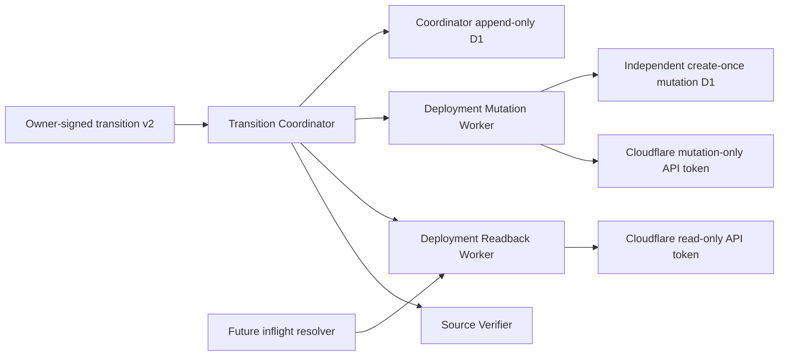

# JSON Compatibility Deployment Readback And Mutation Leaves

## Status

This document defines the D0 physical read/write separation implemented on
2026-08-06. The implementation is a local production-oriented foundation. It
does not claim that either Worker, either credential, either D1 database, or
any target service exists in remote staging.

All tracked gates are false, all tracked database and credential identities
are placeholders, no public route is configured, and no Cloudflare mutation
was performed. Go/VPS remains authoritative and production remains **NO-GO**.

## Physical Topology



The capability split is structural:

| Service | Secret capability | Storage | Callable method |
| --- | --- | --- | --- |
| Transition Coordinator | none | coordinator D1 | `executeTransition`, D1-only `getTransitionStatus` |
| Deployment Readback | read-only Cloudflare API token | none | `readDeploymentState` |
| Deployment Mutation | mutation-only Cloudflare API token | independent mutation D1 | `mutateDeploymentOnce` |
| Future inflight resolver | none | future resolver journal | Reader binding only |

The Coordinator never receives either API token. The Reader has no mutation
binding or D1 mutation journal. The Mutator has no read token and cannot
produce stable target proof. A future resolver must not receive the Mutator
binding.

Service Binding topology is not caller authentication. Any account Worker
that receives a binding could invoke it. Each leaf therefore independently
replays the full owner authorization, and remote promotion additionally
requires an account-wide caller-binding inventory.

## Owner Authority V2

The owner-signed transition request now binds:

- current Plan v5 and state-plan v2;
- the exact frozen transition and all ordered steps;
- complete 18-artifact source inventory readback, not only its digest;
- source authentication roots and the inventory digest;
- Coordinator, Source Verifier, Reader, and Mutator service names,
  entrypoints, version IDs, profile versions, private-RPC flags, capabilities,
  credential identity digests, and service identity digests; and
- the dedicated transition key, audience, issue time, not-before time, and
  expiry.

Reader and Mutator identities are derived from this canonical tuple:

```text
environment + account digest + service + entrypoint + Worker version
+ profile + private-RPC flag + capability + credential ID digest
```

They cannot be supplied as unrelated self-declared hashes. Reader and Mutator
service names, identities, and credential IDs must all differ. The Coordinator
stores the exact authority body and digest in a second immutable D1 table in
the same reservation batch as the operation.

## Reader Boundary

The Reader accepts exactly:

```text
campaignPlan
statePlan
authorizedTransition
sourceAuthentication
readbackRequest
```

Before reading the token binding, it verifies the owner signature, current
authorization window, source proof freshness, operation and plan digests,
exact step and phase, complete artifact inventory, fixed seven-service
allowlist, runtime account identity, credential identity, and its actual
`CF_VERSION_METADATA.id` against the signed Reader authority. Tracked all-zero
identity placeholders are rejected even if the gate is accidentally enabled.

One readback attempt then performs only bounded GET requests:

1. target service deployments;
2. the exact immutable Worker version;
3. target service subdomain and preview state;
4. account Worker custom domains;
5. every page of account-filtered zones in fixed order; and
6. Worker routes for every returned zone.

There is no retry. Redirects are manual, one ten-second deadline covers the
whole attempt, aggregate response bodies are limited to 64 KiB, zone traversal
is limited to eight pages and 128 zones, UTF-8/JSON and pagination are strict,
and each response must contain a bounded request identity. Any network,
deadline, pagination, shape, body, or identity uncertainty returns canonical
v2 `ambiguous` evidence.

The active version ID is joined to the owner-signed immutable artifact
inventory. Live Workers.dev, preview URL, custom-domain, and zone-route state
is reconstructed on every attempt. A non-empty live public route set produces
an observed digest that differs from the required empty digest, so the
Coordinator stops before mutation or refuses target advancement.

The version response is currently used to prove the exact immutable version
and reject unknown/inherited binding shapes. Config, binding, secret-name, and
Durable Object migration digests are projected from the signed inventory once
that exact immutable version is joined. Production therefore still requires
C0/C3 evidence showing how those digests were independently reconstructed
from remote version/config evidence. Synthetic local inventory is not enough.

## Mutator Boundary

The Mutator accepts exactly:

```text
campaignPlan
statePlan
authorizedTransition
sourceAuthentication
mutationIntent
sourceReadbacks
```

Before token access, D1 access, or network access, it independently verifies
the owner signature, source authentication, full inventory, exact authorized
step, both stable source readbacks, Reader service and credential identities,
and the rebuilt mutation intent. It then verifies its actual account, service,
entrypoint, Worker version, profile, credential digest, and derived identity
against the signed Mutator authority. A missing or malformed token fails before
the one-send claim is consumed.

The exact request is derived internally:

```json
{
  "annotations": {
    "workers/message": "cinatoken-json-compatibility-deployment-mutation-v2:<intent-sha256>"
  },
  "strategy": "percentage",
  "versions": [{ "percentage": 100, "version_id": "<target-version>" }]
}
```

The endpoint is the allowlisted account, fixed seven-service target, and
`/deployments` path. `force` is absent. The client performs one raw POST with
manual redirects, no automatic retry, a three-second timeout, and a 64 KiB
response limit. Timeout, transport failure, redirect, 408, 425, 429, 5xx,
oversize body, invalid UTF-8/JSON, or response-shape drift is `ambiguous`.

Before the POST, an independent D1 database atomically creates the exact
mutation claim. The claim binds the owner operation, plans, authority, source
proof, stable source readbacks, intent, target, request body, annotation,
endpoint, Mutator version, and credential identity. Only an unambiguous fresh
insert can send. Conflict, replay, uncertain insert, missing outcome, or
response loss never sends again. Claims and outcomes use D1 time and reject
all updates and deletes.

An accepted API response is not transition success. Only two later Reader
observations of the exact target can advance the state machine.

## Coordinator Integration

The Coordinator now has separate named bindings:

```text
JSON_COMPATIBILITY_DEPLOYMENT_READBACK
JSON_COMPATIBILITY_DEPLOYMENT_MUTATION
JSON_COMPATIBILITY_SOURCE_VERIFIER
```

It checks the signed service names and entrypoints before reserving D1 or
calling a binding. Every Reader and Mutator envelope includes the same complete
owner authorization and source proof, allowing each leaf to validate without
trusting a Coordinator-created summary.

The status RPC remains D1-only. Its v2 response explicitly states that source
verification, Reader calls, Mutator calls, and execution retry were not
performed. Status configuration does not require either leaf binding to be
usable.

Coordinator migration 0002 adds the immutable execution-authority table.
Migration 0001's historical `deployment_leaf_service_name` column is retained
for schema compatibility and stores the Reader service name; migration 0002 is
the authority for the distinct Reader and Mutator identities.

## Local Acceptance

The focused gates are:

```text
bun run check:container-runtime:json-compatibility-deployment-transition
bun run check:container-runtime:json-compatibility-deployment-readback
bun run check:container-runtime:json-compatibility-deployment-mutation
bun run check:container-runtime:json-compatibility-deployment-transition-worker
```

Current local evidence:

| Gate | Result |
| --- | --- |
| shared transition protocol | 14 tests, 157 expectations |
| Reader | 14 tests; TypeScript and generated types pass |
| Reader Wrangler dry-run | 243.14 KiB upload / 41.71 KiB gzip, both gates false |
| Mutator Node | 19 tests |
| Mutator Workerd/D1 | 2 tests |
| Mutator Wrangler dry-run | 255.13 KiB upload / 42.92 KiB gzip, both gates false |
| Coordinator Node | 8 tests |
| Coordinator Workerd/D1 | 2 tests, four concurrent calls, one operation, four mutations, 16 reads |
| Coordinator Wrangler dry-run | 281.70 KiB upload / 46.36 KiB gzip, all gates false |

The Coordinator runtime test uses physically distinct Reader and Mutator mock
Workers. It proves separate call counts, exact terminal replay without leaf
effects, D1-only status, and immutable operation, authority, event, and receipt
tables. The Mutator runtime test applies its actual migration and proves
concurrent claim linearization. Reader tests inject bounded HTTP responses and
do not call Cloudflare.

## Remote Staging Sequence

Do not combine or reorder these steps:

1. Complete and independently approve C0-C4 source, credential, external WORM,
   stable account, and source-publication evidence.
2. Issue distinct short-lived least-privilege Reader and Mutator credentials.
   Retain signed creation, permission, custody, verification, and revocation
   evidence. Never place a token in argv, tracked config, logs, or receipts.
3. Provision the independent Mutator D1 and Coordinator D1 through the D1
   create-once ceremony. Apply exact migrations and independently read back all
   tables, columns, indexes, triggers, foreign keys, and migration heads.
4. Deploy the final private Reader, Mutator, Source Verifier, and Coordinator
   candidate versions with real non-secret identity anchors and their intended
   gates. Do not invoke transition execution. Independently read back version,
   exports, bindings, routes, Workers.dev, previews, secret names without
   values, and D1 bindings.
5. Build the owner execution authority only from those final deployed version
   IDs. Changing a gate or binding creates a different candidate and requires
   a new readback and signature.
6. Prove account-wide caller topology: only the reviewed Coordinator version
   may call Mutator; only Coordinator and the future reviewed resolver may call
   Reader; no unreviewed Worker may hold either binding.
7. Upload and independently read back all 18 service artifacts dark. Rebuild
   config, binding, route, gate, secret-name, and migration digests using the
   approved C0/C3 normalization.
8. Run disabled and status-only probes, then concurrency, crash, timeout,
   response-loss, pagination drift, public-route drift, wrong-version,
   credential-rotation, N/N-1, and post-send D1 ambiguity tests.
9. Implement and approve the Reader-only inflight resolver and locked terminal
   receipt archive before the first real transition.
10. Execute the four transitions only inside isolated staging with Go/VPS
    authoritative and an independently approved rollback decision path.

## Remaining D0 Blockers

D0 is not production-complete until remote evidence proves:

- real least-privilege credentials and distinct credential identities;
- final Worker version and exact configuration readback for all three D0
  services;
- complete live public-route absence and caller-binding topology;
- independently derived immutable config, binding, secret-name, and Durable
  Object migration digests for every signed artifact inventory entry;
- applied and independently read Mutator and Coordinator D1 schemas;
- actual one-send API request and response-loss evidence without retry;
- credential rotation/revocation and wrong-version negative drills;
- Reader-only inflight resolution and locked receipt publication; and
- security, privacy, SRE, release, rollback, campaign, and cutover approval.

Local tests and Wrangler dry-runs establish implementation behavior only. They
grant no Cloudflare deployment or traffic authority.
