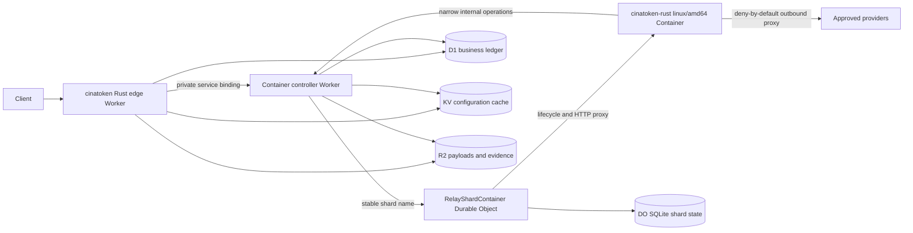
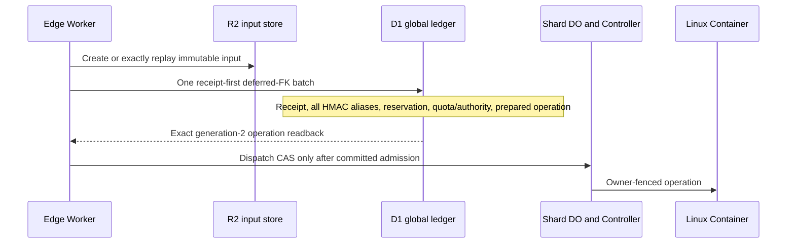
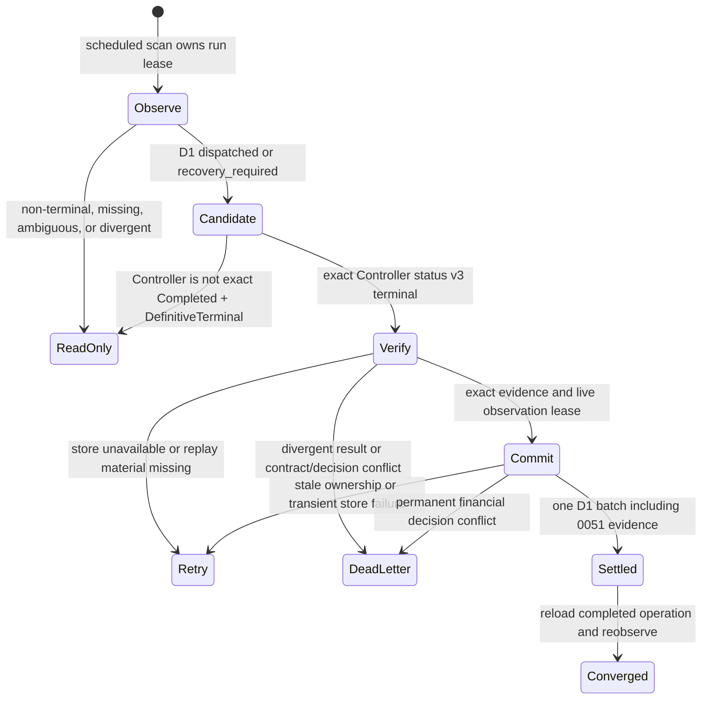

# Native Container Shard Runtime

Status: C1/C2 local substrate, default-off, production **NO-GO**.

This document defines the production architecture for moving selected native
relay execution from the Worker isolate into sharded cinatoken-rust Linux
Containers. It does not authorize deployment or traffic cutover.

## Decision

The target request path is:



`RelayShardContainer` is both the shard coordination atom and the Cloudflare
Container lifecycle owner because the Cloudflare `Container` class extends
`DurableObject`. A second scheduler DO would add another consistency boundary
without improving ownership. The controller Worker is a thin TypeScript
service because the current Rust/Wasm Worker does not export an
`@cloudflare/containers` class.

The public edge Worker remains the only Internet entry point. It owns request
authentication, rate limits, billing admission, idempotency, request bounds,
route policy, and public error shaping. The native Container is an execution
accelerator, never the financial or task-lifecycle authority.

## Official Platform Constraints

The design follows current Cloudflare behavior:

- A `Container` extends a Durable Object and the DO manages routing, persistent
  state, and lifecycle. The DO and Container are not guaranteed to be placed on
  the same host or in the same location:
  <https://developers.cloudflare.com/containers/container-class/> and
  <https://developers.cloudflare.com/containers/platform-details/architecture/>.
- Container local disks are ephemeral. Sleeping or replacing an instance
  starts it from a fresh image. Durable state must be external:
  <https://developers.cloudflare.com/containers/platform-details/architecture/>.
- Container instances are selected and started explicitly today; built-in
  autoscaling is not assumed:
  <https://developers.cloudflare.com/containers/platform-details/scaling-and-routing/>.
- Worker code updates immediately while Containers roll gradually. N and N-1
  protocol versions must coexist during rollout:
  <https://developers.cloudflare.com/containers/platform-details/rollouts/>.
- Container Internet access defaults on. This design requires
  `enableInternet = false`, an allowlist, and a trusted outbound handler:
  <https://developers.cloudflare.com/containers/platform-details/outbound-traffic/>.
- Durable Object alarms are at-least-once, have one active alarm per object,
  and automatically retry a failed invocation only a bounded number of times:
  <https://developers.cloudflare.com/durable-objects/api/alarms/>.
- KV reads are eventually consistent and may lag for 60 seconds or more. KV is
  not an ownership, lease, quota, or billing store:
  <https://developers.cloudflare.com/kv/concepts/how-kv-works/>.
- R2 binding operations are strongly consistent and are suitable for immutable
  payloads and evidence, but last-completing writers still win on one key:
  <https://developers.cloudflare.com/r2/reference/consistency/>.
- A private service binding keeps the controller Worker off the public Internet
  and must be deployed before the caller:
  <https://developers.cloudflare.com/workers/runtime-apis/bindings/service-bindings/>.

## cinaVibeSDK Review

The source review used `C:\cinagroup\cinaVibeSDK` at commit
`918e97480ee44e357abe99bf33c27259d6ac7ebd`.

Patterns retained:

1. Route at the edge before transferring ownership.
2. Address stateful compute by deterministic Durable Object names.
3. Keep relational records in D1, strong per-entity coordination in DO
   storage, cache/configuration in KV, and large objects in R2.
4. Isolate runtime control from public routes.

Patterns rejected:

1. Fixed-pool modulo assignment. Changing the pool remaps most keys and has no
   generation fence.
2. SSH and arbitrary command execution. The relay image has one fixed binary
   and no user-controlled shell entry point.
3. In-memory timers for recovery. Recovery uses persisted alarms, Queues, and
   the existing D1/Cron sweep path.
4. KV read-modify-write for rate, quota, or billing authority.
5. Logging route tokens or injecting provider secrets into the container.
6. Treating Cloudflare account balance checks as customer settlement.

## Component Ownership

### Edge Worker

The existing Rust Worker continues to own:

- token/session authentication and exact owner checks;
- body, header, stream, and deadline limits;
- model mapping and channel policy;
- D1 reserve, settle, refund, audit, and reconciliation state machines;
- operation idempotency and public status routes;
- rate limits, quota admission, and public API compatibility;
- deciding whether the default Worker path or the native shard path is used.

It derives a 32-byte HMAC-SHA-256 routing digest from a canonical tenant scope.
The raw user ID, token ID, tenant ID, or API key is never sent to the shard
planner, returned by capabilities, used as a DO name, or logged.

### Controller Worker

The isolated TypeScript controller Worker now implements these local contracts,
but has not been deployed or bound to the edge Worker:

- export `RelayShardContainer extends Container` and `ContainerProxy`;
- expose only a private service-binding entry point;
- validate a signed, bounded operation envelope from the edge Worker;
- resolve the canonical stable shard name;
- reject stale ring generations and unsupported protocol versions;
- own Container startup, readiness, sleep, stop, and rollout hooks;
- provide narrow D1/KV/R2 binding operations to the Container;
- inject provider credentials only inside an outbound handler;
- emit structured lifecycle and capacity metrics without request secrets.

It must not repeat user authentication or create a second billing authority.

### RelayShardContainer Durable Object

One named DO exists per logical shard. Its stable name is:

```text
cinatoken-relay-shard-v1-0000
cinatoken-relay-shard-v1-0001
...
```

The name does not contain the ring generation. This preserves DO storage for
unchanged shards. Every operation carries the active generation; the DO stores
the accepted generation and rejects stale work before starting the Container.

DO SQLite owns only shard-local coordination:

- accepted ring and protocol versions;
- operation lease and owner generation;
- in-flight concurrency counters and admission queue bounds;
- last Container start/stop/error state;
- alarm cursor, retry count, and drain state;
- compact metadata required to recover after DO eviction.

It does not own user balances, token balances, channel accounting, global task
status, provider credentials, or large request/result bodies.

### Native Container

The image contains a fixed, non-root, `linux/amd64` cinatoken-rust HTTP server.
It receives a bounded operation envelope and references to R2 objects. It may
perform provider transport, streaming adaptation, parsing, tokenization, and
other native execution selected by policy.

The process must assume:

- local files disappear after sleep, restart, OOM, migration, or rollout;
- `SIGTERM` is advisory and cannot be the only persistence path;
- requests can be replayed after an ambiguous response;
- the same operation can arrive more than once;
- startup and port readiness can exceed the edge request deadline;
- outbound Internet is unavailable except through approved policy.

## Stable Shard Contract

The pure `cinatoken-sharding` crate defines contract version 1.

Inputs:

- a non-zero opaque 32-byte keyed routing digest;
- positive `ring_generation`;
- `shard_count` in `1..=1024`.

Selection uses Jump Consistent Hash over the first eight digest bytes in
big-endian order. Increasing N to N+1 leaves all unchanged owners in place and
moves only keys assigned to the new shard. Ring generation is not part of the
hash, so a configuration-only generation increment fences old work without
remapping every tenant.

The returned plan contains only:

- contract version;
- ring generation;
- shard count and index;
- canonical stable instance name.

The controller validates all five fields. A mismatched generation, topology,
version, or name is a fail-closed conflict, not a retry on another shard.

## Operation Protocol

An operation crosses the service boundary only after admission is durable. The
authority token is
`base64url(protected).base64url(claims).base64url(HMAC-SHA256)`. The protected
header fixes `typ`, `alg=HS256`, and a bounded `kid`; signed claims bind issuer,
audience, protocol, dispatch ID, method, path, body digest, issue time, and
expiry. Only the configured current and previous authority key IDs are valid.

The strict JSON operation envelope is:

```text
protocol_version
operation_id
operation_kind
owner_generation
owner_lease_expires_at
execution_deadline_at
provider_operation_id
admission_sha256
input { mode, sha256, size, content_type, request_object_key?, object_version? }
shard { contract_version, ring_generation, shard_count, shard_index, instance_name }
trace_id
```

The body is signed by the edge Worker with a separate internal authority secret.
`dispatch_id` changes per delivery; `operation_id`, `owner_generation`, and the
stable `provider_operation_id` define replay, ownership, and provider
idempotency. The body contains no provider credential, raw routing digest, user
identity, or complete API key.

The execution sequence is:

1. Edge authenticates, validates bounds, selects channel, and creates the D1
   reservation/operation row through the existing idempotent state machine.
2. Edge stores oversized immutable input in R2 under a content-addressed key.
3. Edge derives the HMAC routing digest and computes the shard plan.
4. Controller validates signature, deadline, protocol, ring fence, and shard
   name before forwarding to the named DO.
5. DO atomically claims `operation_id + owner_generation`, checks capacity, and
   persists the claim before starting or calling the Container.
6. Container performs the approved work. Provider credentials are injected by
   trusted outbound policy and never written to its environment or disk.
7. Result bytes are streamed or written to R2. Metadata returns with the same
   operation and owner generation.
8. Edge/D1 applies final settlement through existing CAS and idempotency rules.
9. Queue/Cron reconciliation resolves ambiguous completion. The DO alarm only
   accelerates recovery and never replaces the D1 sweep.

## Storage Contract

| Store | Authoritative data | Forbidden data |
|---|---|---|
| D1 | users, tokens, channels, operation/task lifecycle, reservations, settlement, audit, reconciliation | transient container health and raw large bodies |
| DO SQLite | shard leases, fencing generations, bounded in-flight state, alarm/drain cursors | customer balances, global task authority, provider secrets |
| KV | versioned read-heavy configuration and non-authoritative cache | leases, idempotency, quota, billing, cutover proof |
| R2 | immutable/content-addressed payloads, results, evidence, large logs with retention policy | mutable counters and last-writer-wins workflow state |
| Container disk | disposable scratch only | any recovery source or unique business record |

D1 read replication, when enabled, requires Sessions/bookmarks for read-your-own
writes. Admission and finalization must not read an unconstrained replica after
a write.

## Security Contract

1. No public route, DNS name, or direct non-HTTP ingress targets a Container.
2. The controller Worker has no public route and is reachable only through the
   edge Worker's service binding.
3. `enableInternet = false` is mandatory. The allowlist starts empty.
4. Provider authorization is injected by the trusted outbound handler after
   exact method, host, path, content type, and body-size validation.
5. The image runs as a non-root user, has a read-only application layout, no
   package manager in the runtime stage, no SSH daemon, and one fixed entrypoint.
6. Secrets are provisioned before deployment, never passed on a command line,
   never tracked, and never included in image layers or lifecycle logs.
7. Private envelopes have a bounded clock window, replay identity, audience,
   protocol version, and timing-safe signature validation.
8. Logs use hashed operation identifiers and explicit field allowlists. Request
   bodies, API keys, cookies, authorization headers, provider credentials, R2
   signed URLs, and routing digests are prohibited.
9. Capacity exhaustion returns a stable retryable platform error without
   starting an extra provider operation.
10. Container output is untrusted and passes the same response-size, header,
    content-type, and billing-evidence validation as direct provider output.

## Failure Model

| Failure | Required behavior |
|---|---|
| DO eviction | reconstruct from DO SQLite; no in-memory owner is trusted |
| duplicate alarm | idempotent replay by operation and generation |
| alarm retries exhausted | persist blocked state and rely on Queue/Cron recovery |
| Container cold start or port timeout | no second provider call; return/recover by operation ID |
| Container OOM or host restart | scratch is discarded; operation remains recoverable from D1/DO/R2 |
| stale ring generation | reject before Container start |
| controller overload | do not blindly retry overloaded DO errors |
| ambiguous D1 write | read canonical operation state before retrying mutation |
| R2 duplicate write | content digest and conditional/version checks prevent identity drift |
| KV lag | never affects correctness or owner selection for an accepted operation |
| rolling Worker/Container mismatch | accept protocol N and N-1 or fail before admission |
| max instance capacity | stable 503/capacity result and no unbounded queue |

## Delivery Phases

### Phase C0: planner foundation (complete locally)

- pure Rust versioned shard planner and fencing tests;
- fail-closed Wrangler variables in all environments;
- capability fields with runtime/controller/image/remote proof false;
- architecture, security, failure, cutover, and rollback contracts.

Exit: local crate, Worker, config, frontend type, and repository gates pass.

### Phase C1: isolated controller Worker (local substrate implemented)

- new TypeScript Worker using Bun and `@cloudflare/containers`;
- `RelayShardContainer extends Container` with SQLite DO migration;
- no public route; private service-binding protocol only;
- deny-by-default outbound `ContainerProxy`;
- controller unit tests for signatures plus Workerd/SQLite ledger tests for
  fencing, concurrency, capacity, retention, and eviction;
- independent staging/production Wrangler configs.

Local generated types, strict TypeScript, protocol/config tests, a Wrangler
dry-run bundle, and ten Workerd/SQLite ledger scenarios pass. Exit still
requires an isolated staging deployment with no edge binding plus actual
`RelayShardContainer` startup, lifecycle, secret, eviction, and concurrent
capacity evidence.

### Phase C2: native Rust image (local skeleton implemented)

- add a fixed native server crate and multi-stage `linux/amd64` Dockerfile;
- health/readiness endpoints, graceful drain, hard request/deadline bounds;
- content-addressed R2 input/result protocol;
- provider egress through the controller outbound handler;
- SBOM, dependency/license scan, image signature/digest pin, and vulnerability
  policy.

The current server always executes `health_probe`. It also compiles one
`chat_completions_canary` client, but the client is injected only when
`CINATOKEN_CONTAINER_PROVIDER_CLIENT_ENABLED=true`; every tracked Controller
environment derives that Container variable from a false gate. The image never
receives a provider credential and direct internet access remains disabled.

Exit: local Docker and remote staging prove cold start, sleep, restart, OOM,
ephemeral disk, and protocol N/N-1 behavior without financial mutation.

### Phase C3: shadow routing

- add the controller service binding after C1/C2 are deployed;
- derive HMAC routing keys and compute plans in the edge Worker;
- submit read-only or synthetic operations with zero customer traffic;
- compare direct and Container results, latency, provider attempts, and cost;
- keep final response and billing on the direct path.

Exit: seven-day staging soak and production shadow sample meet parity, privacy,
capacity, and cost budgets.

### Phase C4: bounded canary

- enable only explicit internal token IDs and supported endpoints;
- start at 0.1%, then 1%, 5%, 25%, and 50% with a hold at every step;
- automatic rollback on billing mismatch, duplicate provider attempt, elevated
  5xx, capacity rejection, cold-start tail, DO overload, or redaction failure;
- keep direct Worker execution available for immediate fallback.

Exit: all canary windows and rollback drills have dated evidence.

### Phase C5: production cutover

- make Container routing the selected path only for proven operation kinds;
- retain direct path and reconciliation tooling for at least one release train;
- remove fallback only after disaster recovery, PITR, image rollback, and cost
  reviews pass.

Exit: migration completion matrix has no open critical gate. This phase is not
currently authorized.

## Required Configuration

Tracked, non-secret variables:

```text
CONTAINER_SCHEDULER_RING_GENERATION=1
CONTAINER_SCHEDULER_SHARD_COUNT=8
CONTAINER_SCHEDULER_ENABLED=false
CONTAINER_SCHEDULER_STAGING_VERIFIED=false
CONTAINER_PROVIDER_ATTEMPT_JOURNAL_ENABLED=false
CONTAINER_PROVIDER_CLIENT_ENABLED=false
CONTAINER_PROVIDER_EGRESS_ENABLED=false
CONTAINER_PROVIDER_RETRY_ENABLED=false
CONTAINER_PROVIDER_ATTEMPT_STAGING_VERIFIED=false
CONTAINER_MAX_PROVIDER_ATTEMPTS=1
```

Tracked controller configuration now includes explicit `max_instances`,
`instance_type`, rollout percentages, active grace period, sleep timeout,
required ports, per-shard concurrency, seven-day terminal retention, and a
10,000-row terminal-history target. Placement constraints, image digest,
protocol N/N-1, and account queue limits remain future configuration.

Future secrets include the routing HMAC secret, edge-to-controller authority
secret, and provider credentials used only by the outbound handler. Their
capabilities may be exposed as booleans, never values.

## Production Gates

All gates are mandatory:

1. planner contract and cross-language golden vectors;
2. valid versioned ring in every environment;
3. routing HMAC secret provisioned and rotated;
4. controller service binding exists and has no public route;
5. signed native image and fixed entrypoint;
6. deny-by-default egress with exact provider allowlist;
7. D1/DO/KV/R2 ownership contract tests;
8. N/N-1 rolling protocol and image rollback;
9. bounded per-shard and account capacity with tested rejection;
10. DO eviction, duplicate alarm, retry exhaustion, sleep, OOM, host restart,
    D1 ambiguity, R2 replay, KV lag, and overload fault matrix;
11. billing no-double-charge and provider no-double-submit evidence;
12. staging soak, canary, rollback, privacy, and cost evidence.

`container_scheduler_cutover_ready` must remain false until every gate is true
from current remote evidence. Local compilation cannot promote remote fields.

## Rollback

Rollback changes routing before changing infrastructure:

1. Set `CONTAINER_SCHEDULER_ENABLED=false` at the edge and deploy the caller.
2. Confirm new operations stay on the direct Worker path.
3. Drain accepted Container operations by their persisted owner generation.
4. Reconcile ambiguous operations from D1/Queue/Cron; do not resubmit blindly.
5. Preserve DO storage, R2 evidence, image digest, logs, and deployment metadata.
6. Roll back the controller/image only after the edge no longer sends new work.
7. Delete no image needed by a Worker version that may still be rolled back.

The rollback target is the existing Worker/DO/D1 path, not a VPS. VPS remains
an emergency external recovery option until the Cloudflare migration is fully
accepted, but it is not part of the steady-state shard protocol.

## 2026-07-16 Local Implementation Evidence

Implemented locally:

- `services/container-controller`: three explicit environment configs,
  `RelayShardContainer` SQLite migration, signed authority verification,
  complete shard fence, dispatch replay, owner/idempotency conflicts, persisted
  lifecycle state, retryable capacity backpressure without a poisoned terminal
  claim, bounded terminal history, and deny-all HTTP/HTTPS egress;
- ten Workerd/SQLite ledger scenarios cover max+1 concurrent admission,
  operation and dispatch conflicts, expired 504 recovery with late-result CAS,
  time/count compaction, refreshed-dispatch protection, retry after capacity
  release, legacy rejection migration, replay-window backpressure, and eviction
  persistence;
- `cinatoken-container-authority`: bounded Rust signer/verifier and a shared
  Rust/TypeScript golden vector;
- `cinatoken-container-runtime`: axum health/readiness/operation server, 64 KiB
  body limit, strict validation, graceful shutdown, and fail-closed provider
  execution;
- Rust 1.78 builder plus distroless non-root runtime Dockerfile, `lite` instance
  type, eight-instance maximum, staged rollout, and SSH off.

The edge config now declares environment-specific private service bindings and
matching authority metadata. The Rust admin capability probe signs the shared
empty-body GET vector, bounds fetch plus response parsing to three seconds and
4 KiB, and distinguishes binding, authority, contract, Controller-enable, and
execution-enable state. The probe is false in every tracked environment and no
remote binding has been verified.

Still absent: routing/authority/provider secret provisioning, targeted shard
`/readyz` proof, D1/KV/R2 controller operations, provider allowlists and
credential injection, actual `RelayShardContainer` Workerd/Container process
tests for protocol, `containerFetch`, and lifecycle hooks, N/N-1 protocol,
signed image digest/SBOM/scan, remote lifecycle/fault evidence, and
staging/canary/cutover authorization. The local host has no Docker engine, so
no image or real Container was started. See
`docs/container-execution-plane-source-audit.md` for the cinaVibeSDK and Go
cinatoken source-to-target contract.

## 2026-07-16 Targeted Readiness Contract

The local control plane now exposes an admin-only targeted shard probe through
the edge Worker. The edge derives `ShardPlan` from the active ring and signs a
bounded POST over the private `CONTAINER_CONTROLLER` Service Binding. No public
Controller URL or caller-supplied instance name exists.

Readiness has two non-interchangeable modes:

- `ledger`: read persisted lifecycle, active versus expired in-flight counts,
  terminal count, and the last probe record. It never invokes a Container API,
  always returns `ready=false`, and labels its verdict `unknown`.
- `live`: explicitly cold-start-capable. It records a one-time dispatch and
  monotonic probe generation before `containerFetch('/readyz')`, consumes a
  bounded response, samples `getState`, and commits only through generation
  CAS. A concurrent probe receives a stable conflict and a recently completed
  probe is subject to a short cooldown.

`process_ready` means the strict runtime response and Cloudflare Container
health agree. `execution_ready` additionally requires runtime and Controller
execution gates, a non-draining shard, and free admission capacity. The current
runtime reports execution disabled, so a healthy local process must still
produce top-level `ready=false`.

All edge and Controller read/wake/staging switches remain false. This contract
does not replace actual Container lifecycle, N/N-1, provider, storage, billing,
load, cost, image supply-chain, canary, or rollback evidence. Production stays
**NO-GO**.

## 2026-07-16 Durable Outcome and Deadline Recovery

The shard ledger now separates definite failure from ambiguous execution.
claimed expiry becomes failed before dispatch; running expiry becomes
recovery_required and cannot automatically retry, switch channel, settle, or
refund. Before dispatch the Controller persists a reconcileOperationDeadline
task through the Container library schedule API. Its callback is fenced by
operation ID, owner generation, and the stored deadline.

The Container response is no longer a transient accepted/rejected
acknowledgement. It is a strict completed/rejected/recovery_required envelope.
For every non-health completion, its R2 result manifest must exactly match the
manifest already attached to the DO. Terminal duplicate requests return an
outcome reconstructed from durable state without waking the Container.

The D1 storage action now requires reserved state plus live billing lease and
owner deadline. This is still a local contract: byte replay, provider attempts,
billing terminalization, real Container scheduling, and remote fault evidence
are not complete. See docs/container-operation-recovery.md. Production remains
**NO-GO**.

## 2026-07-16 Owner-Fenced Shared Storage Gateway

`RelayShardContainer.outboundByHost` now exposes four internal-only storage
actions. Cloudflare evaluates `allowedHosts` before the handlers, and each
handler runs in the Worker trust domain with bindings plus `ctx.containerId`.
The Controller converts that opaque Container ID to exactly one `RELAY_SHARDS`
Durable Object and asks its durable ledger for an operation grant. A grant is
valid only for the current owner generation while the operation is running and
before its deadline.

| Action | Container request | Durable effect |
| --- | --- | --- |
| Input | Exact R2 object read | Body streams only after version/digest/size/type verification |
| Result | Immutable R2 object create | R2 version and object identity are generation-CAS attached to the operation |
| Config | Fixed KV snapshot read | Bounded operation-kind configuration only |
| Admission | Fixed D1 reservation read | Minimal owner-fenced reservation state only |

There is deliberately no generic storage proxy: no R2 list/delete/overwrite,
no arbitrary KV key, and no caller-supplied SQL. Result replay is exact and
idempotent; conflicting content fails closed. The Worker cancels or consumes
bounded bodies on rejection so failed authorization does not become an
unbounded memory or connection path.

Activation order is Controller deployment with all four gates false, remote
binding readback, one isolated R2 input canary, KV and D1 read canaries, then a
create-only R2 result canary with DO replay verification. Actual operation
traffic remains later and separately gated. Evidence must include wrong-owner,
expired-deadline, object-version drift, checksum mismatch, duplicate replay,
conflict, KV lag, D1 ambiguity, Container restart, and N/N-1 cases. Until that
remote evidence exists, this is a compiled local contract and production is
**NO-GO**.

## 2026-07-17 Provider Attempt Journal Topology

The provider-attempt virtual host is a fifth named outbound handler, but it is
not a provider proxy yet. Its trust path is:

```text
Container
  -> provider-attempt.cinatoken.internal
  -> Controller outbound handler (ctx.containerId)
  -> exact named RelayShardContainer DO
  -> DO SQLite attempt projection + immutable events + frozen retry state
```

The Container supplies only operation ID, owner generation, and attempt
generation. The outbound handler derives the DO from `ctx.containerId`; the DO
rereads its own operation and policy rows. Exact host, path, method, body shape,
size, and content type are enforced. Query strings, alternate hosts, ports,
credentials, unknown fields, and attempt generations outside 1..3 fail closed.

The control order is persist-before-send:

1. The Controller schedules deadline recovery through the Container class.
2. The DO atomically starts the operation and writes prepared attempt 1.
3. The Container asks the DO to consume dispatch authority.
4. Only the first committed prepared-to-dispatched transition may authorize a
   future provider send; replay receives false authority.
5. The Container reports one strict terminal classification. Success is not
   accepted until the exact R2 result has been attached under the same attempt
   generation.
6. The Worker reads signed status v2 for reconciliation and falls back to
   unchanged v1 only when talking to an older Controller.

Step 4 currently stops at a dispatch grant. There is no atomic private provider
Service Binding broker that combines grant consumption with provider fetch,
and the Linux image does not call these routes. Consequently the journal gate
must stay false. `enableInternet=false` and the deny-all fallback continue to
prevent a direct internet bypass.

The future broker must own credential injection, provider allowlist, absolute
deadline, bounded request/response streaming, provider-native idempotency or
lookup, terminal classification, and redacted metrics. It must be a private
Service Binding reached only after the DO output gate releases the committed
dispatch transition. A timeout after that point is recovery evidence, never
permission for another request-local send.

Retry state is present only to freeze policy and prove later lifecycle rules.
Tracked runtime config and code both prohibit actual retry. Enabling retry will
remain invalid until a DO-owned schedule callback, generation-fenced alarm or
Container schedule contract, versioned multi-attempt R2 manifest, global D1
terminal ack, and restart/duplicate fault campaign are implemented and
reviewed. Production remains **NO-GO**.

## 2026-07-17 Private Provider Egress Canary

The missing local provider transport is now compiled as a deliberately narrow,
default-off canary. It is not a generic relay proxy and it does not move channel
selection, model mapping, billing snapshots, usage interpretation, settlement,
retry policy, or channel health into the Container plane. Those decisions stay
at the edge before the immutable operation is admitted.

The private path is fixed:

```text
Rust Linux Container
  -> provider-egress.cinatoken.internal
  -> RelayShardContainer.outboundByHost (exact ctx.containerId)
  -> exact shard DO attempt journal + global D1 admission read
  -> PROVIDER_EGRESS Service Binding
  -> cinatoken-container-egress Worker
  -> one fixed HTTPS upstream profile
```

`enableInternet=false` remains authoritative. The Container allowlist contains
only the synthetic internal host; it never contains the real provider host.
Cloudflare evaluates the allowlist before the outbound handler, and the handler
runs in the Controller Worker trust domain with D1, R2, the Service Binding, and
the exact Container identity. The broker Worker has no route, disables
`workers_dev` and preview URLs, and receives its API key only as the
`CINATOKEN_CONTAINER_PROVIDER_API_KEY` secret.

The only compiled profile is
`openai-chat-completions-canary-v1`. It accepts POST JSON up to 4 MiB, requires
the exact body SHA-256, operation/owner/attempt identity, a configured model,
`stream=false`, and an absolute deadline no more than five minutes ahead. It
constructs a fresh outbound request with a fixed host/path and header set,
injects the credential inside the broker, denies redirects, aborts at the
deadline, bounds the provider response to 4 MiB, and never retries. The
Container, DO, D1, R2, logs, and response manifests never receive that secret.

Authority is consumed in this order:

1. The Linux client reads and re-hashes the exact owner-fenced R2 input.
2. The Controller rereads the exact DO grant and rejects identity, kind, input,
   attempt, hash, size, content type, or five-minute deadline drift.
3. A strict D1 read proves the global operation is already `dispatched` with
   the same immutable admission fields.
4. The DO commits the one-shot `prepared -> dispatched` attempt transition.
5. Only that first committed result may cross the private Service Binding.
6. A successful JSON response is content-hashed and written create-only to R2,
   attached to the same DO attempt generation, and then recorded as succeeded.

Every deterministic validation owned by the Controller, including Service
Binding presence, occurs before step 4. After step 4, binding transport loss,
broker gate/model/credential rejection, timeout, non-2xx response,
invalid/oversized response, R2 uncertainty, DO attach uncertainty, or terminal
RPC uncertainty is recovery evidence. It returns a strict 202 ambiguous outcome
and cannot authorize a second provider send. A dispatched replay without an
attached result converges
to ambiguous without calling the broker. A replay with an attached exact result
finishes the same attempt without calling the broker. A lost terminal RPC first
rereads canonical DO state.

Deployment must remain target-first and disable-first: deploy the broker with
its gate false and no public route; verify the target Worker and binding; deploy
the Controller with journal/client/egress gates false; deploy the image; then
exercise only health, storage, and synthetic pre-dispatch rejection. The first
real provider request requires an approved isolated staging operation and all
three journal/client/egress gates, while retry and staging-verification remain
false. Rollback first closes client admission at the Controller, then egress,
and preserves DO/R2/D1 evidence for every accepted operation.

This is still not production-ready. The fixed profile is deployment-local, not
an immutable D1/DO egress-profile version. Provider-native idempotency or lookup,
durable upstream status/header provenance, definite non-2xx classification,
global terminal acknowledgement and compaction, multi-provider adapters,
streaming, remote broker readiness/deployment-version readback, real
Linux/Cloudflare Container execution, N/N-1, credential rotation, remote
R2/DO/network fault campaigns, load/cost/alert evidence, exact edge replay,
financial convergence, and C1-C5 approvals remain open. All tracked gates stay
false, no provider or remote deployment was invoked, and production remains
**NO-GO**.

## 2026-07-17 Pre-Dispatch Broker Readiness

Binding presence alone did not prove that the target broker had its runtime
gate, fixed model, and secret configured. Discovering one of those deterministic
errors after consuming the DO dispatch transition would create an avoidable
ambiguous attempt. The Controller now performs one bounded private readiness
call after exact D1 admission and before dispatch.

The call is an exact GET to
`/internal/v1/provider-egress/readiness` over the existing `PROVIDER_EGRESS`
Service Binding. It carries only protocol and profile identifiers, has no body,
uses the operation deadline with a two-second maximum, and performs no provider
I/O. The broker returns ready only when its gate is true, its configured model
is nonempty, and its API-key secret exists and is nonempty. The response is
no-store, at most 1 KiB, and contains exactly protocol version 1, the fixed
profile identifier, and `ready=true`. It never returns the model or credential.

The Controller requires status 200, JSON content type, exact protocol/profile
headers, and the exact three-field body. A timeout, non-200, oversized body,
unknown field, wrong profile, or missing binding returns 503 before the DO can
leave `prepared`. If the Linux client conservatively reports that response as
recovery-required, the existing DO finalizer converts the still-prepared attempt
to `cancelled` with `provider_attempt_not_dispatched`; it does not manufacture an
ambiguous provider send.

Local Workerd runs the compiled Rust Worker behind five Service Bindings and
proves ready, disabled, missing-model, missing-secret, and missing-version
behavior plus method and profile rejection. The ready response contains neither
configured value, and the readiness path does not call the local outbound
provider mock.

This probe is configuration readiness, not provider health. It does not prove
credential validity, provider reachability, quota, model entitlement, or atomic
version affinity between readiness and execute. Production still requires
target-first deployment, remote binding/version readback, mixed-version proof,
credential rotation, and a separately approved real provider canary. All
tracked runtime gates remain false and production remains **NO-GO**.

## 2026-07-17 Version-Affined Provider Broker

The private provider Worker now binds Cloudflare Worker Version Metadata in
every environment. An enabled instance without a valid runtime version ID is
not ready and cannot execute. Readiness keeps the exact legacy-compatible
three-field v1 body and returns the actual ID in a private response header;
successful execute responses and version-resolved policy failures carry the
same header.

Controller readiness and execute subrequests use one
`Cloudflare-Workers-Version-Key` equal to the immutable
`provider_operation_id`. Cloudflare therefore gives both requests stable
deployment routing when the deployment percentages permit it. The Controller
does not treat that behavior as a lock: it persists the readiness ID during the
DO dispatch transaction and independently requires the execute response ID to
match. Execute protocol v2 also sends that committed ID as the expected Worker
version. The broker compares it to its own Version Metadata before reading the
body, credential, or provider network path.

The provider-attempt authority path is now:

```text
D1 exact admission
  -> version-affined broker readiness
  -> DO dispatch V2 + immutable broker profile/version event
  -> version-affined one-shot execute v2 + pre-I/O expected-version guard
  -> exact execute-version comparison
  -> R2 metadata v3 + DO attach + terminal event
```

The old DO dispatch RPC, null identity rows, and R2 metadata schemas 1/2 remain
available for N/N-1 read and replay compatibility. New versioned sends require
the V2 RPC and fail before provider I/O if an older DO does not implement it.
DO schema upgrades are additive and idempotent; identity assignment is guarded
by SQLite and runtime validation.

Broker rollout is target first: broker N preserves the body expected by
Controller N-1, then Controller N begins requiring the version header. Rollback
reverses the order. Broker N accepts legacy execute v1 for N-1 callers, while
Controller N sends execute v2 with the expected version; both broker N and the
old broker reject an incompatible v2 request before provider I/O. The Rust R2
observer also reads result metadata schemas
1/2/3 as exact, version-specific contracts, so schema-3 canary results are not
misclassified as inventory corruption.

This closes local broker-version provenance only. It does not yet record the
edge Worker version, Controller ingress version, shard DO code version, or
Container artifact digest as one end-to-end execution tuple. It also does not
provide a remote version pin, provider idempotency, or deployment promotion
proof. All execution gates remain false and production remains **NO-GO**.

## 2026-07-18 D1 Atomic Admission Boundary

Migration `0050_relay_container_atomic_admission.sql` closes the local partial
admission gap for the bounded chat canary. It does not move financial authority
into the shard DO or Linux Container. The edge remains responsible for client
idempotency, frozen pricing, user/token quota, selected channel authority, and
the global operation owner before the Controller may receive a dispatch.



R2 remains outside the transaction. An input object written by a losing or
failed contender is not admission, dispatch, or billing authority. Production
must define bounded orphan retention and deletion using immutable object
identity and age; cleanup must never infer that an R2 object represents a
committed operation.

### Global owner contract

One tenant-scoped client idempotency HMAC over user ID, token ID, and the
validated `Idempotency-Key` produces one stable reservation key. Model,
selected group/channel, transformed provider input, and pricing are excluded.
The request-conflict digest is separately defined as model plus the original
request body only.

The immutable atomic digest binds the persisted winner's frozen billing
snapshot, selected channel/group/type/snapshot key, transformed input content,
shard/ring, provider-operation identity, and order-independent HMAC alias-set
digest. These are dispatch and settlement authority, not client identity. The
current secret defines the canonical reservation/operation identity. The same
batch claims the current HMAC and, when distinct, the previous-key HMAC in
immutable `relay_container_idempotency_aliases`; its global alias primary key
is the rolling-version serialization point.

After request parse, model/auth resolution, and relay rate limiting, the edge
derives current/previous HMAC candidates plus the model/original-body digest and
queries that alias table as the 0050 replay authority. A `NotFound` reaches
retry/fallback parsing, current
channel-pool discovery, affinity, provider conversion, ordinary reserve/debit,
or send only when a successful history probe proves 0050 history is empty and
replay-only mode is inactive. Any miss with durable history returns 503 because
an absent older secret generation cannot be distinguished from a new request.
A matching alias resumes the persisted winner even if its channel is
disabled or removed. A different model/original body is a request conflict;
schema/query failure or internally divergent persisted state fails closed, and
immutable divergence is a server-side 503 rather than a client 409.

The admitted canary owner is fixed to generation 2 with attempt count 1 and
provider attempt generation 1. The selected flat-pricing snapshot key is the
textual selected channel type and is persisted in the receipt. This keeps later
provider-usage settlement tied to the admitted pricing map even if the channel
row changes.

Three-record settlement revalidation does not trust receipt linkage from
admission time alone. Both the quote and final financial commit reread the
atomic receipt, billing reservation, and Container operation, recompute the
billing snapshot SHA-256 and complete atomic admission digest, and reject
before mutation if any record diverges.

The D1 batch inserts that receipt first under deferred foreign keys, then every
one- or two-member alias claim, the selected reservation, user debit, token
debit, channel-authority no-op update, and prepared operation. Each mutation is
followed by a one-row guard. The authority statements recheck user
status/deletion/quota, token ownership/status/deletion/expiry/quota, and channel
status/type/group/model ability inside the same transaction. Any alias conflict
or later failure rolls back all alias, admission, and financial changes;
post-error readback checks all supplied aliases for the persisted winner.

### Dispatch and replay rule

The receipt is the only marker that the edge may interpret as admitted. It
stores `idempotency_alias_count` and the order-independent
`idempotency_aliases_sha256` digest of the sorted, length-framed alias set. The
operation insert trigger requires the exact receipt, canonical alias, and
reservation, so a pre-0050 writer cannot leave an unmarked canary operation.
Alias and receipt mutation/deletion are rejected; canary operation deletion is
rejected; later operation updates require exact receipt linkage.

Only an exact newly applied or matching resumable readback may continue to the
dispatch CAS. A completed/failed replay requires the immutable financial
terminal receipt; `recovery_required` also requires matching financial
evidence. A missing receipt, one-sided reservation/operation, owner mismatch,
snapshot drift, or divergent terminal record fails closed as immutable
identity conflict. Dispatch, settlement, and terminal audit take channel/group
from the persisted operation, never a retry-time selection. The DO and
Container cannot repair or override that result.

### Replay-only rollback boundary

The local edge now has a replay-only foundation separate from new admission.
`CONTAINER_CHAT_CANARY_REPLAY_ONLY_ENABLED` and
`CONTAINER_CHAT_CANARY_PREPARED_RESUME_ENABLED` are default-false exact-`true`
gates. Replay-only remains restricted to the eligible route and configured
token/model cohort. It does not change the final
`container_chat_canary_admission_compiled()` false gate.

New admission is canonical-current-write and atomically claims the current plus
distinct previous HMAC aliases. Replay derives current then previous candidates
and follows either alias to the persisted canonical-current winner. A rolling
Worker using the other current key cannot create a second reservation or
operation because the global alias claim conflicts, rolls back the batch, and
forces persisted-winner readback. Removing the previous key before a proved
drain would strand otherwise valid historical identities.

The recovery lookup cannot fall back around its authority. Every eligible
idempotent request probes 0050 history even when one or both read secrets are
configured. Missing/incomplete schema, failed history/alias queries, divergent
linkage, or any alias miss with existing history returns 503. Ordinary relay
processing after a miss is allowed only when the history probe succeeds,
reports no durable 0050 history, and replay-only mode is inactive. This remains
strict until bounded secret-generation/key-ID coverage and retention are
implemented and remotely verified.

Replay lookup runs after request parse, model/auth, and relay rate limiting but
before retry/model fallback, current channel discovery/selection, affinity,
provider transformation, ordinary reserve/debit, and upstream send. In an
active replay-only cohort, a miss returns HTTP 503 with `Retry-After: 5` and
cannot fall through to ordinary admission or provider execution. A
completed/failed owner permits read-only terminal replay only with the
exact-response replay gate and `FILE_BUCKET`; otherwise it returns HTTP 202
pending. `dispatched`/`recovery_required` require Controller/replay readiness.
Before `prepared` advances in D1 it additionally requires operation replay
readiness, scheduler enablement, a valid ring and routing secret, the explicit
prepared-resume gate, and a verified Controller status proving binding,
authority, controller enablement, and execution enablement. Closed state gates
leave the durable owner `prepared` rather than dispatching a replacement.

### Verification and rollout status

The current local test tree covers the actual migration/batch path,
all-or-nothing admission, persisted-winner readback, quota/authority/marker
rollback, old-writer rejection, alias schema/digest/immutability, three-record
settlement, current/previous identity derivation, and state-specific replay
decisions. The completed local validation reports Workerd 14/14, Worker Rust
820/820, and SQLite 50 migrations / 48 tables / 540 incremental columns / 72
key indexes; the repository-wide `bun run check`, including the root Worker
Wrangler dry-run, also passes. Endpoint-level replay-only miss isolation,
schema/query 503s, missing/stale-secret history, unknown-history probing,
history-backed alias misses, real-D1 alias collision under key rotation, and
state gates across D1/R2/DO/Controller still require dedicated local and remote
proof.

Before 0050 can be applied remotely, every pre-0050 canary writer must be
disabled, inventoried, removed, and observed absent for a computed drain
window. The migration itself rejects any existing protocol-v1 chat canary
operation. After apply, operators must read back the exact receipt table,
alias table, both indexes, all eight guards, normalized trigger bodies,
alias-set integrity, and unchanged business-data fingerprints while every
execution gate remains false.

Aggregate platform capability/migration-head wiring is complete locally. It now
reports boolean-only `container_chat_canary_replay_history_probe_known` and
`container_chat_canary_replay_history_present`, R2 binding
availability, `container_chat_canary_terminal_replay_runtime_ready`,
`container_chat_canary_dispatched_recovery_runtime_ready`, and
`container_chat_canary_prepared_resume_runtime_ready`, plus aggregate replay
readiness and atomic compiled/schema fields.
`container_chat_canary_replay_only_active` is only the actual flag plus a
configured cohort predicate; it does not include or replace any readiness.
Individual route/token/model membership remains a request-time check. An
unknown history probe forces all replay-readiness fields false. A false history
value is rollback evidence only when schema readiness and
`container_chat_canary_replay_history_probe_known=true`; no identity is exposed.
Authenticated remote schema/capability proof, real Container lifecycle, N/N-1
campaign, endpoint-level Worker fault matrix, real two-version key rotation,
remote D1/Controller/R2 evidence, R2 orphan policy, scheduled terminalizer,
provider idempotency/lookup, shared response interpretation, financial
convergence, load/cost/alerts, and rollback rehearsal are pending. The
default-off replay-only and atomic current/previous-alias foundation is
implemented locally, but cutover still requires code audit, a signed
replay-only artifact, a key-retention/previous-key drain runbook, dedicated
fault proof, and rehearsal.
Existing owners must remain replayable without allowing new admission across
rollback or secret rotation.
`container_chat_canary_atomic_admission_compiled()` is true for the local
implementation, but `container_chat_canary_admission_compiled()` remains false
and is the controlling production gate. No deployment is claimed; production
remains **NO-GO**.

## 2026-07-18 Owner-Fenced Scheduled Terminalizer Runtime

Migration 0051 adds local append-only proof for the reconciliation schedule
that wins an exact financial terminalization. It does not give the scheduler
general operation authority. The observer may enter the terminal path only
when `CONTAINER_SCHEDULED_TERMINALIZER_ENABLED` and
`CONTAINER_SCHEDULED_TERMINALIZER_STAGING_VERIFIED` are both exact `true`, the
existing operation replay authority is ready, `FILE_BUCKET` exists, and the
0051 table, index, and three guards are ready. Before a scheduled run claims an
item, a live Controller probe must prove probe enablement, service binding,
configured authority, signature verification, controller enablement, and
execution enablement; the capability endpoint uses that same probe. Both new
gates are tracked as `false` for local, staging, and production; 0051 is not
remotely applied.



`ReadOnly` never claims, dispatches, wakes, retries, or sends to the provider.
Only exact Controller `Completed` classified as `DefinitiveTerminal`, using
status contract v3 with no v1/v2 fallback, is eligible. The result manifest is
rejected above the 4 MiB replay ceiling before its body is buffered. A matching
but non-definitive terminal, failed operation, recovery-required Controller
result, absent receipt, R2 drift, or unavailable store remains observation
evidence and cannot authorize settlement or refund. Typed terminalizer failures
preserve exact error codes: availability and missing replay material remain
bounded retries, while divergent response material, contract violations, and
conflicting terminal decisions dead-letter immediately.

The D1 terminal batch contains terminal event, outbox, accounting, operation,
reservation, and 0051 scheduled evidence. The 0051 guard proves the live
observation claim owner/generation and exact frozen lease expiry, checks both
lease and recovery horizon against D1 transaction-time `unixepoch()`, maps D1
`dispatched` to reconciliation revision 1 and `recovery_required` to revision
2, and checks the exact settled receipt/result/terminal contract plus the 0050
admission. A stale lease or any later statement failure rolls back every D1
effect. The R2 client artifact is created before this transaction and is never
authority by itself; a failed D1 commit leaves an orphan candidate for the
bounded inventory policy.

Client and scheduled completion use one financial audit schema v2 derived from
the persisted reservation and operation. It includes the frozen
`request_id_hash` but excludes per-attempt request ID/CF Ray and client IP, so
the same terminal decision has the same audit digest regardless of which path
observes it.

A lost response after D1 commit is safe to read back. The completed operation,
settled reservation, terminal receipt/event/outbox, and immutable 0051 row
identify the winner. A later schedule reobserves convergence and does not send
the provider or settle again. A crash before commit leaves the lease to expire
and another generation may reobserve. Update/delete of 0051 evidence and a
commit from a stale claim owner are rejected.

### Durable Object production ABI

The cinaVibeSDK patterns are retained as design input, with these stronger
cinatoken contracts:

- **Object identity:** retain exactly one named DO/Container per logical shard,
  using `cinatoken-relay-shard-v1-XXXX`. The tenant HMAC routing digest selects
  the shard and is never part of the DO name; a tenant-specific name would
  change the architecture into an unbounded per-tenant Container fleet.
  Separate Worker service/namespace/binding deployments isolate environments.
  Persist the namespace, service/binding/class tuple, canonical-name digest,
  jurisdiction, shard index, and ring generation with the operation.
- **Jurisdiction (future, not implemented locally):** create the
  jurisdiction-restricted subnamespace before
  deriving the object ID and verify `ctx.id.jurisdiction` inside the object.
  The same name has a different ID in another jurisdiction, so a mismatch must
  fail rather than create a second owner. Existing object identity is
  immutable; relocation creates an explicitly versioned destination and a
  drained/verified transfer. Jurisdiction controls DO compute/storage locality;
  Regional Services is a separate ingress-locality decision.
- **Class lifecycle:** service name, binding name, class name, storage backend,
  and the selected Wrangler lifecycle declaration form one ABI. This repository
  currently uses legacy append-only `migrations`; `exports` is now preferred
  for new Workers and is mutually exclusive. Freeze one mechanism before the
  first remote deploy. New namespaces use SQLite. Class rename/delete/transfer
  is atomic and cannot ride a gradual deployment; require binding inventory,
  stored-data compatibility, remote reconciliation output, old-object drain,
  and a compatible rollback reader.
- **Cold start:** initialization is idempotent, blocks requests until local
  schema/state validation finishes, restores durable owner/deadline/alarm/result
  facts, and performs no provider or financial side effect. Constructor
  `blockConcurrencyWhile` is bounded to schema/state work, performs no external
  I/O, and stays below its reset timeout. SQL schema version lives in a durable
  migration table, not `PRAGMA user_version`. Memory caches are disposable and
  initialization failure closes readiness.
- **Alarm N/N-1:** the `Container` base class owns the one platform alarm and
  multiplexes callbacks through `schedule()`; subclasses do not override
  `alarm()` or separately call `setAlarm`. Persist versioned application intent
  and owner/shard/deadline/delivery generations in DO SQLite. The current reader
  accepts legacy three-field v0 and strict v1 while v1 writing is double-gated.
  `@cloudflare/containers` 0.3.7 catches callback exceptions and deletes the
  one-shot task, so the callback must persist delivery first and create its own
  bounded retry or quarantine. Duplicate, early, delayed, stale, exhausted,
  and rollback-era tasks never resend a provider or commit financial state.
- **Provenance:** one redacted execution tuple joins edge and Controller
  deployment IDs, DO namespace/class/migration/schema/object digest,
  jurisdiction, Container image/protocol, broker profile/version, provider
  receipt/result, D1 migration/operation, R2 versions/digests, terminal
  event/outbox, financial receipt, and 0051 observation claim.

Production evidence must exercise real object eviction, cold/warm start,
duplicate alarms, old-schema objects, N/N-1 deployment and rollback, class
migration, jurisdiction mismatch, Container sleep/restart/OOM, D1 response
loss, and R2 orphan/replay. Readiness must fail before provider I/O whenever an
identity, class, schema, alarm, or provenance element is unknown.

Normal rollback closes both terminalizer gates first, then admission, prepared
resume, provider and reconciliation producers; it routes new work to Go/VPS,
drains leases, and retains 0051 plus a compatible recovery reader. Schema
rollback, evidence deletion, ambiguous provider retry, and ad hoc financial
compensation are forbidden. Until remote migration/readback, mixed-version
lifecycle faults, provider idempotency/lookup, amount/invoice convergence,
shared response semantics, and named approval are archived, production remains
**NO-GO**.

## 2026-07-18 Durable Bootstrap And Deadline Alarm Intent v1

The isolated Controller now has a local, default-off deadline recovery bridge.
This is DO-local SQLite state, not global D1 state, and therefore adds no D1
0052 migration.

The frozen sequence is:

1. With both writer gates true, `claimOperation` inserts the operation and its
   first unarmed v1 intent in one synchronous SQLite transaction.
2. The Controller calls the base class `schedule()` for `deadline_at + 1`.
3. Exact payload and delivery generation readback marks the intent armed.
4. A callback records delivery locally before terminal reconciliation.
5. Success or an already terminal operation marks the intent completed; a
   transient callback failure advances a deterministic bounded retry; identity
   conflict or exhaustion quarantines.

The intent stores operation/owner/deadline identity, delivery generation and
count, armed/next-delivery state, error classification, and the complete shard
fence. Identity is immutable. A terminal operation update closes a pending
intent in the same SQLite transaction, and operation compaction removes its
intent. Direct deletion while the operation exists and replacement insert are
blocked. At most eight deliveries are accepted by both payload and SQL checks,
and retries stop after the 24-hour horizon. Cold start validates every migration
row, rejects unknown future versions, and refuses initialization if any pending
intent cannot be rearmed.

The reader supports two payloads:

- v0: exact legacy `{operation_id, owner_generation, deadline_at}`;
- v1: exact version/kind plus delivery generation and canonical shard tuple.

The v1 reader and cold-start rearm remain active even when the writer is off.
The writer requires both
`CONTAINER_OPERATION_RECOVERY_INTENT_V1_ENABLED` and
`CONTAINER_OPERATION_RECOVERY_INTENT_V1_STAGING_VERIFIED`; all tracked scopes
set both to `false`. A rollback artifact must retain the v1 reader after any v1
write. An older artifact must be drained or isolated before writer activation.
Execution is now interlocked with these gates at both the outer Controller and
the shard DO: enabling execution with either gate false fails before claim and
makes readiness false. New code never emits v0; v0 is reader-only.

`@cloudflare/containers` 0.3.7 remains the sole platform-alarm owner. Its base
class multiplexes tasks in `container_schedules`, catches callback exceptions,
and deletes the one-shot task. `RelayShardContainer` therefore neither
overrides `alarm()` nor calls `setAlarm`; application retry/quarantine is
completed inside the callback. A persistence or reschedule failure invokes
`ctx.abort()` before base-class one-shot cleanup can complete. Constructor rearm
is bounded to local schema and intent work under `blockConcurrencyWhile` and
touches no network, D1, R2, provider, Container process, or financial path.

Local tests cover the pure ABI (Controller 95/95) and a real Workerd SQLite
ledger object (34/34), including eviction. They do not instantiate the actual
Container-derived
class, execute its base alarm, or start Linux. Promotion still requires real
class eviction/restart/OOM, package alarm failure, duplicate schedule,
mixed-version, jurisdiction, provider-call-counter, load/cost, alert, and
rollback evidence. Production remains **NO-GO**.

The next implementation milestone is the shared Go-authoritative response
interpreter for exact HTTP-200 success, HTTP-200 typed errors, compatible
non-200 envelopes/header filtering, and interrupted-stream usage retention.

That contract is now specified as `go-openai-response-v1`, pinned to Go commit
`73652508abc5cb09214dde02d51d69d1d1ccc703`, with a pure implementation in
`crates/relay`. This does not make the Container response path replayable.
Receipt v1 cannot encode rejected provider evidence or a rebuilt client body;
the runtime remains blocked on response-artifact migration 0052, protocol v3,
and separate provider/client status. The complete design is in
`docs/response-interpreter-production-plan.md`.

## Immutable Activation Inventory (2026-07-19)

The application now has a local implementation for enumerating logical shard
activation without iterating Durable Object IDs or waking Containers.

The Container runtime prewarms a chunked executable hash and returns a
64-character lowercase SHA-256 build ID from `/readyz`; hash failure returns a
typed 503 rather than panicking. The Controller combines this with Version Metadata, ring generation,
canonical shard name, runtime/shard protocols, readiness generation, gate
state, environment, and observation time. It inserts one immutable D1 row only
when recording is explicitly enabled and the runtime build equals the frozen
expected candidate. The unique key includes both Controller and runtime build,
so an N-1 build cannot consume the candidate row during a rollout.

The edge Worker exposes a root-authenticated read-only projection. The first
page freezes the maximum activation event sequence for one Controller version
and ring. Later pages must supply that watermark and a strictly increasing
cursor. The response includes no secret, raw payload, tenant identity, DO ID,
or Container endpoint. The handler reads D1 only, verifies every row and digest,
and sets `Cache-Control: no-store`.

The offline collector treats the endpoint as an append-only event ledger, not a
trusted summary. It recomputes each digest, requires exactly one candidate row
for every shard index, requires generation one and a row no older than two
hours at observation start or more than 60 seconds in the future, and compares
complete before/after canonical records.
Missing, duplicate, unknown-build, wrong-ring, enabled-execution, cursor, or
stability failures block P5.

The static activation-recording variable is not yet an executable production
ceremony. Changing it on and off creates different Controller versions, while
the ledger and all-gates-false source must bind one exact version. A
root-authorized same-version campaign with nonce, expiry, per-shard single use,
automatic seal, and immutable audit remains required before live collection.

This ledger proves application-observed activation. It does not prove the
Cloudflare namespace has no hidden object, that a sleeping Container is running,
or that a runtime hash belongs to a specific image. Those claims remain on the
control-plane inventory and runtime-to-image provenance planes. No remote
activation evidence exists yet; production remains **NO-GO**.

## Linux Process Gate And Edge Provenance (2026-07-19)

The earlier statement that the same-version activation ceremony was absent is
superseded by migration 0055, but neither that ceremony nor a source-only
Dockerfile proves the native process. The release path now has three distinct
identities:

1. root edge Worker Version Metadata;
2. Controller Version Metadata plus its canonical all-false action-gate digest;
3. Container image identity plus the runtime executable SHA-256 returned by
   `/readyz`.

The admin capability endpoint exposes the first two identities without waking
a DO or Container. The third is produced by a dedicated Linux release job. Its
Dockerfile builder and distroless runtime are digest-pinned, and its checkout
action is pinned to a full commit. The job builds `linux/amd64` and runs the
image rather than treating `wrangler --dry-run` or Rust unit tests as a native
process substitute.

The process verifier creates an isolated internal Docker network. A
digest-pinned Node mock owns only `r2-input.cinatoken.internal` and
`provider-egress.cinatoken.internal`; neither the runtime nor mock receives a
Cloudflare/provider credential or customer request. Both containers use
read-only roots, dropped capabilities, `no-new-privileges`, bounded memory and
PIDs. No container port is published to the host. A read-only probe mounted in
the mock container calls `runtime.cinatoken.internal` and the mock's loopback
listener from inside the same `--internal` network.

The mandatory scenarios are:

- `/healthz` and `/readyz`, including execution enabled and a 64-hex build ID;
- one health operation with no provider path;
- one successful canary with one input read and one provider dispatch;
- one accepted ambiguous outcome mapped to `recovery_required`, with no retry;
- one same-length input corruption rejected before provider dispatch;
- SIGTERM graceful exit code zero; and
- same-image restart with the same runtime build ID.

The offline contract test is in the repository-wide check and cannot authorize
remote mutation, customer traffic, or cutover. The actual Linux job result must
be retained and joined to Cloudflare deployment/image readback, SBOM/signature
provenance, same-version N/N activation, remote lifecycle faults, and rollback
evidence. Until that happens, the runtime remains a local candidate and
production remains **NO-GO**.
