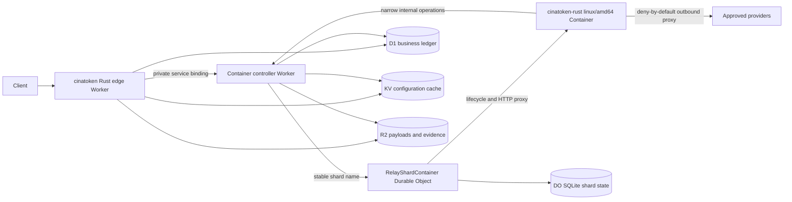

# Native Container Shard Runtime

Status: C1/C2 local substrate, default-off, production **NO-GO**.

This document defines the production architecture for moving selected native
relay execution from the Worker isolate into sharded cinatoken-rust Linux
Containers. It does not authorize deployment or traffic cutover.

## Decision

The target request path is:



`RelayShardContainer` is both the shard coordination atom and the Cloudflare
Container lifecycle owner because the Cloudflare `Container` class extends
`DurableObject`. A second scheduler DO would add another consistency boundary
without improving ownership. The controller Worker is a thin TypeScript
service because the current Rust/Wasm Worker does not export an
`@cloudflare/containers` class.

The public edge Worker remains the only Internet entry point. It owns request
authentication, rate limits, billing admission, idempotency, request bounds,
route policy, and public error shaping. The native Container is an execution
accelerator, never the financial or task-lifecycle authority.

## Official Platform Constraints

The design follows current Cloudflare behavior:

- A `Container` extends a Durable Object and the DO manages routing, persistent
  state, and lifecycle. The DO and Container are not guaranteed to be placed on
  the same host or in the same location:
  <https://developers.cloudflare.com/containers/container-class/> and
  <https://developers.cloudflare.com/containers/platform-details/architecture/>.
- Container local disks are ephemeral. Sleeping or replacing an instance
  starts it from a fresh image. Durable state must be external:
  <https://developers.cloudflare.com/containers/platform-details/architecture/>.
- Container instances are selected and started explicitly today; built-in
  autoscaling is not assumed:
  <https://developers.cloudflare.com/containers/platform-details/scaling-and-routing/>.
- Worker code updates immediately while Containers roll gradually. N and N-1
  protocol versions must coexist during rollout:
  <https://developers.cloudflare.com/containers/platform-details/rollouts/>.
- Container Internet access defaults on. This design requires
  `enableInternet = false`, an allowlist, and a trusted outbound handler:
  <https://developers.cloudflare.com/containers/platform-details/outbound-traffic/>.
- Durable Object alarms are at-least-once, have one active alarm per object,
  and automatically retry a failed invocation only a bounded number of times:
  <https://developers.cloudflare.com/durable-objects/api/alarms/>.
- KV reads are eventually consistent and may lag for 60 seconds or more. KV is
  not an ownership, lease, quota, or billing store:
  <https://developers.cloudflare.com/kv/concepts/how-kv-works/>.
- R2 binding operations are strongly consistent and are suitable for immutable
  payloads and evidence, but last-completing writers still win on one key:
  <https://developers.cloudflare.com/r2/reference/consistency/>.
- A private service binding keeps the controller Worker off the public Internet
  and must be deployed before the caller:
  <https://developers.cloudflare.com/workers/runtime-apis/bindings/service-bindings/>.

## cinaVibeSDK Review

The source review used `C:\cinagroup\cinaVibeSDK` at commit
`918e97480ee44e357abe99bf33c27259d6ac7ebd`.

Patterns retained:

1. Route at the edge before transferring ownership.
2. Address stateful compute by deterministic Durable Object names.
3. Keep relational records in D1, strong per-entity coordination in DO
   storage, cache/configuration in KV, and large objects in R2.
4. Isolate runtime control from public routes.

Patterns rejected:

1. Fixed-pool modulo assignment. Changing the pool remaps most keys and has no
   generation fence.
2. SSH and arbitrary command execution. The relay image has one fixed binary
   and no user-controlled shell entry point.
3. In-memory timers for recovery. Recovery uses persisted alarms, Queues, and
   the existing D1/Cron sweep path.
4. KV read-modify-write for rate, quota, or billing authority.
5. Logging route tokens or injecting provider secrets into the container.
6. Treating Cloudflare account balance checks as customer settlement.

## Component Ownership

### Edge Worker

The existing Rust Worker continues to own:

- token/session authentication and exact owner checks;
- body, header, stream, and deadline limits;
- model mapping and channel policy;
- D1 reserve, settle, refund, audit, and reconciliation state machines;
- operation idempotency and public status routes;
- rate limits, quota admission, and public API compatibility;
- deciding whether the default Worker path or the native shard path is used.

It derives a 32-byte HMAC-SHA-256 routing digest from a canonical tenant scope.
The raw user ID, token ID, tenant ID, or API key is never sent to the shard
planner, returned by capabilities, used as a DO name, or logged.

### Controller Worker

The isolated TypeScript controller Worker now implements these local contracts,
but has not been deployed or bound to the edge Worker:

- export `RelayShardContainer extends Container` and `ContainerProxy`;
- expose only a private service-binding entry point;
- validate a signed, bounded operation envelope from the edge Worker;
- resolve the canonical stable shard name;
- reject stale ring generations and unsupported protocol versions;
- own Container startup, readiness, sleep, stop, and rollout hooks;
- provide narrow D1/KV/R2 binding operations to the Container;
- inject provider credentials only inside an outbound handler;
- emit structured lifecycle and capacity metrics without request secrets.

It must not repeat user authentication or create a second billing authority.

### RelayShardContainer Durable Object

One named DO exists per logical shard. Its stable name is:

```text
cinatoken-relay-shard-v1-0000
cinatoken-relay-shard-v1-0001
...
```

The name does not contain the ring generation. This preserves DO storage for
unchanged shards. Every operation carries the active generation; the DO stores
the accepted generation and rejects stale work before starting the Container.

DO SQLite owns only shard-local coordination:

- accepted ring and protocol versions;
- operation lease and owner generation;
- in-flight concurrency counters and admission queue bounds;
- last Container start/stop/error state;
- alarm cursor, retry count, and drain state;
- compact metadata required to recover after DO eviction.

It does not own user balances, token balances, channel accounting, global task
status, provider credentials, or large request/result bodies.

### Native Container

The image contains a fixed, non-root, `linux/amd64` cinatoken-rust HTTP server.
It receives a bounded operation envelope and references to R2 objects. It may
perform provider transport, streaming adaptation, parsing, tokenization, and
other native execution selected by policy.

The process must assume:

- local files disappear after sleep, restart, OOM, migration, or rollout;
- `SIGTERM` is advisory and cannot be the only persistence path;
- requests can be replayed after an ambiguous response;
- the same operation can arrive more than once;
- startup and port readiness can exceed the edge request deadline;
- outbound Internet is unavailable except through approved policy.

## Stable Shard Contract

The pure `cinatoken-sharding` crate defines contract version 1.

Inputs:

- a non-zero opaque 32-byte keyed routing digest;
- positive `ring_generation`;
- `shard_count` in `1..=1024`.

Selection uses Jump Consistent Hash over the first eight digest bytes in
big-endian order. Increasing N to N+1 leaves all unchanged owners in place and
moves only keys assigned to the new shard. Ring generation is not part of the
hash, so a configuration-only generation increment fences old work without
remapping every tenant.

The returned plan contains only:

- contract version;
- ring generation;
- shard count and index;
- canonical stable instance name.

The controller validates all five fields. A mismatched generation, topology,
version, or name is a fail-closed conflict, not a retry on another shard.

## Operation Protocol

An operation crosses the service boundary only after admission is durable. The
authority token is
`base64url(protected).base64url(claims).base64url(HMAC-SHA256)`. The protected
header fixes `typ`, `alg=HS256`, and a bounded `kid`; signed claims bind issuer,
audience, protocol, dispatch ID, method, path, body digest, issue time, and
expiry. Only the configured current and previous authority key IDs are valid.

The strict JSON operation envelope is:

```text
protocol_version
operation_id
operation_kind
owner_generation
owner_lease_expires_at
execution_deadline_at
provider_operation_id
admission_sha256
input { mode, sha256, size, content_type, request_object_key?, object_version? }
shard { contract_version, ring_generation, shard_count, shard_index, instance_name }
trace_id
```

The body is signed by the edge Worker with a separate internal authority secret.
`dispatch_id` changes per delivery; `operation_id`, `owner_generation`, and the
stable `provider_operation_id` define replay, ownership, and provider
idempotency. The body contains no provider credential, raw routing digest, user
identity, or complete API key.

The execution sequence is:

1. Edge authenticates, validates bounds, selects channel, and creates the D1
   reservation/operation row through the existing idempotent state machine.
2. Edge stores oversized immutable input in R2 under a content-addressed key.
3. Edge derives the HMAC routing digest and computes the shard plan.
4. Controller validates signature, deadline, protocol, ring fence, and shard
   name before forwarding to the named DO.
5. DO atomically claims `operation_id + owner_generation`, checks capacity, and
   persists the claim before starting or calling the Container.
6. Container performs the approved work. Provider credentials are injected by
   trusted outbound policy and never written to its environment or disk.
7. Result bytes are streamed or written to R2. Metadata returns with the same
   operation and owner generation.
8. Edge/D1 applies final settlement through existing CAS and idempotency rules.
9. Queue/Cron reconciliation resolves ambiguous completion. The DO alarm only
   accelerates recovery and never replaces the D1 sweep.

## Storage Contract

| Store | Authoritative data | Forbidden data |
|---|---|---|
| D1 | users, tokens, channels, operation/task lifecycle, reservations, settlement, audit, reconciliation | transient container health and raw large bodies |
| DO SQLite | shard leases, fencing generations, bounded in-flight state, alarm/drain cursors | customer balances, global task authority, provider secrets |
| KV | versioned read-heavy configuration and non-authoritative cache | leases, idempotency, quota, billing, cutover proof |
| R2 | immutable/content-addressed payloads, results, evidence, large logs with retention policy | mutable counters and last-writer-wins workflow state |
| Container disk | disposable scratch only | any recovery source or unique business record |

D1 read replication, when enabled, requires Sessions/bookmarks for read-your-own
writes. Admission and finalization must not read an unconstrained replica after
a write.

## Security Contract

1. No public route, DNS name, or direct non-HTTP ingress targets a Container.
2. The controller Worker has no public route and is reachable only through the
   edge Worker's service binding.
3. `enableInternet = false` is mandatory. The allowlist starts empty.
4. Provider authorization is injected by the trusted outbound handler after
   exact method, host, path, content type, and body-size validation.
5. The image runs as a non-root user, has a read-only application layout, no
   package manager in the runtime stage, no SSH daemon, and one fixed entrypoint.
6. Secrets are provisioned before deployment, never passed on a command line,
   never tracked, and never included in image layers or lifecycle logs.
7. Private envelopes have a bounded clock window, replay identity, audience,
   protocol version, and timing-safe signature validation.
8. Logs use hashed operation identifiers and explicit field allowlists. Request
   bodies, API keys, cookies, authorization headers, provider credentials, R2
   signed URLs, and routing digests are prohibited.
9. Capacity exhaustion returns a stable retryable platform error without
   starting an extra provider operation.
10. Container output is untrusted and passes the same response-size, header,
    content-type, and billing-evidence validation as direct provider output.

## Failure Model

| Failure | Required behavior |
|---|---|
| DO eviction | reconstruct from DO SQLite; no in-memory owner is trusted |
| duplicate alarm | idempotent replay by operation and generation |
| alarm retries exhausted | persist blocked state and rely on Queue/Cron recovery |
| Container cold start or port timeout | no second provider call; return/recover by operation ID |
| Container OOM or host restart | scratch is discarded; operation remains recoverable from D1/DO/R2 |
| stale ring generation | reject before Container start |
| controller overload | do not blindly retry overloaded DO errors |
| ambiguous D1 write | read canonical operation state before retrying mutation |
| R2 duplicate write | content digest and conditional/version checks prevent identity drift |
| KV lag | never affects correctness or owner selection for an accepted operation |
| rolling Worker/Container mismatch | accept protocol N and N-1 or fail before admission |
| max instance capacity | stable 503/capacity result and no unbounded queue |

## Delivery Phases

### Phase C0: planner foundation (complete locally)

- pure Rust versioned shard planner and fencing tests;
- fail-closed Wrangler variables in all environments;
- capability fields with runtime/controller/image/remote proof false;
- architecture, security, failure, cutover, and rollback contracts.

Exit: local crate, Worker, config, frontend type, and repository gates pass.

### Phase C1: isolated controller Worker (local substrate implemented)

- new TypeScript Worker using Bun and `@cloudflare/containers`;
- `RelayShardContainer extends Container` with SQLite DO migration;
- no public route; private service-binding protocol only;
- deny-by-default outbound `ContainerProxy`;
- controller unit/Workerd tests for signatures, fencing, capacity, and storage;
- independent staging/production Wrangler configs.

Local generated types, strict TypeScript, protocol/config tests, and a Wrangler
dry-run bundle pass. Exit still requires isolated staging deployment with no
edge binding plus startup, binding, secret, SQLite eviction, and concurrent
capacity evidence.

### Phase C2: native Rust image (local skeleton implemented)

- add a fixed native server crate and multi-stage `linux/amd64` Dockerfile;
- health/readiness endpoints, graceful drain, hard request/deadline bounds;
- content-addressed R2 input/result protocol;
- provider egress through the controller outbound handler;
- SBOM, dependency/license scan, image signature/digest pin, and vulnerability
  policy.

The current server executes only `health_probe`; every other valid operation
returns `execution_not_enabled`. Provider transport and credentials are absent.

Exit: local Docker and remote staging prove cold start, sleep, restart, OOM,
ephemeral disk, and protocol N/N-1 behavior without financial mutation.

### Phase C3: shadow routing

- add the controller service binding after C1/C2 are deployed;
- derive HMAC routing keys and compute plans in the edge Worker;
- submit read-only or synthetic operations with zero customer traffic;
- compare direct and Container results, latency, provider attempts, and cost;
- keep final response and billing on the direct path.

Exit: seven-day staging soak and production shadow sample meet parity, privacy,
capacity, and cost budgets.

### Phase C4: bounded canary

- enable only explicit internal token IDs and supported endpoints;
- start at 0.1%, then 1%, 5%, 25%, and 50% with a hold at every step;
- automatic rollback on billing mismatch, duplicate provider attempt, elevated
  5xx, capacity rejection, cold-start tail, DO overload, or redaction failure;
- keep direct Worker execution available for immediate fallback.

Exit: all canary windows and rollback drills have dated evidence.

### Phase C5: production cutover

- make Container routing the selected path only for proven operation kinds;
- retain direct path and reconciliation tooling for at least one release train;
- remove fallback only after disaster recovery, PITR, image rollback, and cost
  reviews pass.

Exit: migration completion matrix has no open critical gate. This phase is not
currently authorized.

## Required Configuration

Tracked, non-secret variables:

```text
CONTAINER_SCHEDULER_RING_GENERATION=1
CONTAINER_SCHEDULER_SHARD_COUNT=8
CONTAINER_SCHEDULER_ENABLED=false
CONTAINER_SCHEDULER_STAGING_VERIFIED=false
```

Future tracked controller configuration includes explicit `max_instances`,
`instance_type`, rollout percentages, active grace period, sleep timeout,
required ports, placement constraints, image digest, protocol N/N-1, per-shard
concurrency, and queue limits.

Future secrets include the routing HMAC secret, edge-to-controller authority
secret, and provider credentials used only by the outbound handler. Their
capabilities may be exposed as booleans, never values.

## Production Gates

All gates are mandatory:

1. planner contract and cross-language golden vectors;
2. valid versioned ring in every environment;
3. routing HMAC secret provisioned and rotated;
4. controller service binding exists and has no public route;
5. signed native image and fixed entrypoint;
6. deny-by-default egress with exact provider allowlist;
7. D1/DO/KV/R2 ownership contract tests;
8. N/N-1 rolling protocol and image rollback;
9. bounded per-shard and account capacity with tested rejection;
10. DO eviction, duplicate alarm, retry exhaustion, sleep, OOM, host restart,
    D1 ambiguity, R2 replay, KV lag, and overload fault matrix;
11. billing no-double-charge and provider no-double-submit evidence;
12. staging soak, canary, rollback, privacy, and cost evidence.

`container_scheduler_cutover_ready` must remain false until every gate is true
from current remote evidence. Local compilation cannot promote remote fields.

## Rollback

Rollback changes routing before changing infrastructure:

1. Set `CONTAINER_SCHEDULER_ENABLED=false` at the edge and deploy the caller.
2. Confirm new operations stay on the direct Worker path.
3. Drain accepted Container operations by their persisted owner generation.
4. Reconcile ambiguous operations from D1/Queue/Cron; do not resubmit blindly.
5. Preserve DO storage, R2 evidence, image digest, logs, and deployment metadata.
6. Roll back the controller/image only after the edge no longer sends new work.
7. Delete no image needed by a Worker version that may still be rolled back.

The rollback target is the existing Worker/DO/D1 path, not a VPS. VPS remains
an emergency external recovery option until the Cloudflare migration is fully
accepted, but it is not part of the steady-state shard protocol.

## 2026-07-16 Local Implementation Evidence

Implemented locally:

- `services/container-controller`: three explicit environment configs,
  `RelayShardContainer` SQLite migration, signed authority verification,
  complete shard fence, dispatch replay, owner/idempotency conflicts, persisted
  capacity-rejection source path, lifecycle state, and deny-all HTTP/HTTPS
  egress;
- `cinatoken-container-authority`: bounded Rust signer/verifier and a shared
  Rust/TypeScript golden vector;
- `cinatoken-container-runtime`: axum health/readiness/operation server, 64 KiB
  body limit, strict validation, graceful shutdown, and fail-closed provider
  execution;
- Rust 1.78 builder plus distroless non-root runtime Dockerfile, `lite` instance
  type, eight-instance maximum, staged rollout, and SSH off.

Still absent: edge service binding, routing/authority/provider secrets,
D1/KV/R2 controller operations, provider allowlists and credential injection,
bounded terminal-operation retention/compaction, Controller Workerd tests for
SQLite concurrency/capacity/eviction, N/N-1 protocol, signed image
digest/SBOM/scan, remote lifecycle/fault evidence, and
staging/canary/cutover authorization. The local host has no Docker engine, so
no image or real Container was started.
