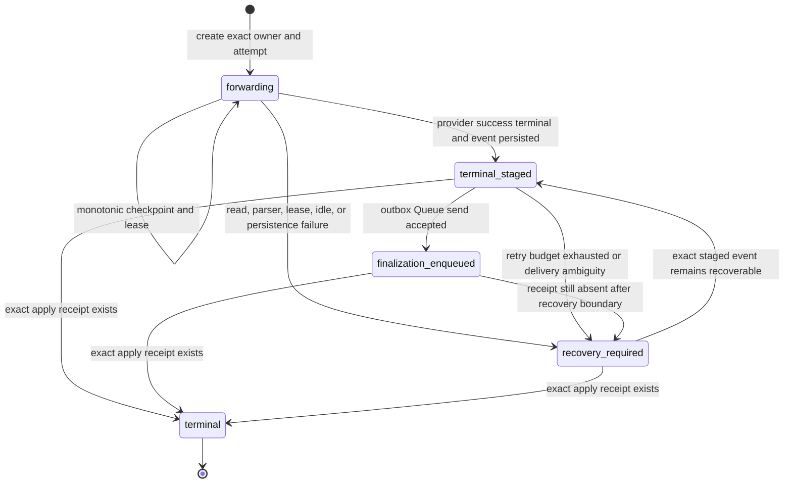

# Ordinary HTTP SSE Durable Terminal Handoff v1

Date: 2026-07-22

Status: implemented and locally verified, default-off in every tracked
environment. It authorizes no remote migration, staging traffic, customer
traffic, production cutover, or Go/VPS shutdown.

## Purpose

Paid HTTP SSE cannot rely on an isolate-local cloned response body to finish
billing after client delivery begins. The client, provider stream, Worker
isolate, Queue acknowledgement, D1 write, and reservation lease can fail at
different points. This design gives one provider attempt a durable D1 handoff,
bounded checkpoints, an immutable finalization event, a leased outbox, and an
exact apply receipt.

The safety objective is:

- one provider attempt per admitted reservation generation;
- one frozen billing contract and selected channel/group identity;
- monotonic, bounded terminal evidence without request or response bodies;
- one receipt-bound financial terminal, even when Queue delivery is ambiguous;
- explicit `recovery_required` when success cannot be proven; and
- no automatic provider resend from recovery.

This is for ordinary Worker HTTP SSE only. Container `stream:true`, WebSocket
Realtime, async task polling, and Go/VPS process drain have separate ownership
contracts.

## Components

| Component | Responsibility |
| --- | --- |
| Relay response path | Select the positive reservation, verify runtime gates and schema, create the handoff before the first client byte, and expose one instrumented upstream stream |
| SSE accumulator | Incrementally inspect bounded lines, classify provider terminal success/failure, and retain only normalized usage counters |
| `relay_http_stream_handoffs` | Freeze identity, owner and attempt generation, checkpoint counters/digest, terminal evidence, outbox lease, and recovery state |
| `relay_http_stream_finalization_receipts` | Append-preserved proof that the exact finalization event was applied to the exact reservation generation |
| `BILLING_QUEUE` | Deliver the already frozen finalization event; it does not recompute pricing or authorize another provider call |
| Scheduled Worker | Lease due outbox work, retry with a bounded backoff, dead-letter without changing event identity, sweep expired forwarding leases, and reconcile exact receipts |

Migration `0056_relay_http_stream_handoffs.sql` is the current source-tree D1
head. Local exact-set replay reports 56 migrations, 64 tables, 814 checked
incremental columns, and 94 key indexes.

## Runtime Gates

All four variables are exact-string booleans and are tracked as `false` in the
default, staging, and production Wrangler environments.

| Variable | Meaning |
| --- | --- |
| `RELAY_HTTP_STREAM_DURABLE_HANDOFF_ENABLED` | Allows a positive paid SSE request to enter the durable producer path |
| `RELAY_HTTP_STREAM_DURABLE_HANDOFF_STAGING_VERIFIED` | Independent approval latch required by producer, outbox, and recovery paths |
| `RELAY_HTTP_STREAM_OUTBOX_ENABLED` | Allows scheduled leasing and Queue delivery of staged finalization events |
| `RELAY_HTTP_STREAM_RECOVERY_ENABLED` | Allows lease-expiry sweep and receipt reconciliation |

Producer admission requires all four gates, the billing Queue binding, Worker
version metadata, migration 0056 readiness, and an active positive billing
reservation. A requested producer with missing staging approval fails closed.

Outbox and recovery are deliberately independent from the producer gate. After
producer rollback, operators may keep the staging approval plus outbox and
recovery gates enabled to drain rows that were already created. They still
cannot run without the staging approval latch.

## Durable State Machine



`terminal` is not permitted merely because a reservation looks settled. The
financial-terminal trigger requires an append-preserved receipt whose event ID
and SHA-256 match the handoff, whose reservation and owner generation match,
and whose audit-log finalization event exists. Applying a Queue event uses one
D1 batch to create the receipt and perform the terminal transition.

## Persisted Evidence

The handoff persists only:

- reservation key, owner generation, attempt generation, channel, group, and
  expression hash;
- domain-separated provider operation ID, Worker version ID, and frozen
  billing-snapshot SHA-256;
- monotonic checkpoint sequence, chunk/byte counts, normalized usage counters,
  rolling stream SHA-256, and reservation-bounded lease expiry;
- terminal kind/reason/time and immutable finalization event ID, JSON, and
  SHA-256;
- outbox availability, lease token/generation/expiry, attempt count, delivery
  status, and bounded error code; and
- recovery and exact finalization-apply timestamps.

The finalization event is capped at 64 KiB and outbox errors at 4 KiB. Request
bodies, prompts, response bodies, raw SSE frames, provider credentials, client
credentials, Cloudflare credentials, cookies, and raw account/resource IDs are
forbidden from both tables and operational evidence.

## Invariants

1. Identity fields and frozen billing hashes never change after insert.
2. A request-path replay of an existing handoff is rejected. Only a new
   `Applied` insert may own the client stream.
3. Every checkpoint and terminal transition compares reservation owner
   generation and stream attempt generation.
4. Checkpoint sequence, chunks, bytes, usage counters, and lease expiry are
   monotonic. Usage regression is rejected by SQL and a D1 trigger.
5. A stream handoff cannot extend past the matching reserved billing lease.
6. Terminal event ID, JSON, and hash are write-once. Dead-letter processing
   changes only delivery/recovery fields.
7. Outbox claim is one `UPDATE ... RETURNING` lease operation. Delivery,
   retry, and dead-letter writes compare the returned lease generation/token.
8. Queue acknowledgement is not financial truth. Only the exact D1 apply
   receipt permits `terminal`.
9. Recovery never dispatches or retries the provider request and never reads
   mutable pricing.
10. Stream usage parse failure ignores partial usage and settles only at the
    already approved frozen reserve for both tiered and flat billing modes.

## Request Path

1. Complete normal authentication, channel selection, billing pre-consumption,
   provider dispatch, and upstream response-header validation.
2. For a positive reservation, require the complete durable gate set, billing
   Queue binding, Worker version metadata, and the 0056 schema.
3. Hash the stored frozen billing snapshot and derive the provider operation ID
   from reservation, owner generation, channel, selection time, and bounded
   upstream request identity.
4. Insert `forwarding` with attempt generation. Refuse matching replay,
   terminal, stale-generation, and conflicting rows.
5. Return a response backed by one instrumented stream. Every chunk is hashed
   and parsed once before being yielded to the client.
6. Checkpoint after 16 chunks, 64 KiB, or a lease-heartbeat boundary. Renew the
   billing lease first and bind the handoff lease to that exact expiry.
7. On provider-confirmed successful terminal, create the audit plus billing
   finalization event, persist its immutable JSON/hash with the final
   checkpoint, and only then release the terminal chunk.
8. The scheduled outbox sends the persisted event. The Queue consumer applies
   existing idempotent billing logic, writes the audit event and exact receipt,
   and transitions the handoff to `terminal`.

A provider `response.failed` or `response.incomplete` terminal is not treated
as billable success. It checkpoints what was observed, moves to
`recovery_required` with `provider_error`, and requires an explicit recovery
policy.

## Failure Matrix

| Failure | Current convergence | Promotion requirement |
| --- | --- | --- |
| Before provider dispatch | Existing reservation recovery owns it; no handoff exists | Workerd and staging counter proof |
| Provider accepted, before response headers/handoff insert | Reservation lease can recover, but provider terminal evidence is absent | Must close or formally accept this crash window before paid rollout |
| Handoff insert before first client byte fails | Request fails closed; reservation lease remains recoverable | D1 fault injection and zero client-body proof |
| Stream read, parser bound, or idle timeout | Generation-fenced `recovery_required`; no provider resend | Real Workerd plus staging fault proof |
| Provider failed/incomplete terminal | Checkpoint then `recovery_required/provider_error` | Approved billing policy and invoice reconciliation |
| EOF without provider terminal | Client stream errors and row becomes recovery-required | Provider-family fixtures proving terminal classification |
| Terminal event D1 write fails | Client terminal is not released; recovery-required is attempted | D1 ambiguity and restart proof |
| Queue send accepted but local mark fails | Event can redeliver; immutable event and receipt make apply idempotent | Real Queue acknowledgement ambiguity drill |
| Queue retries exhausted | Delivery is dead-lettered without event replacement; row remains recoverable | Alert, operator replay, and retention drill |
| Apply succeeds but response/ack is lost | Exact receipt reconciliation transitions to terminal | Queue redelivery plus D1 receipt proof |
| Client stops pulling or cancels | Stream future may stop polling; lease expiry and sweep own eventual recovery | Cancellation-specific Workerd and staging evidence |
| Worker restart | D1 state survives; outbox/recovery resume only under drain gates | Real restart/version-skew campaign |

## Rollout

### S0: Security And Candidate Freeze

- Revoke the exposed Cloudflare credential. Never use it for readback or
  mutation.
- Issue separate least-privilege deploy and readback identities through the
  approved secret workflow.
- Freeze Rust commit, Worker version, schema digest, billing Queue binding,
  migration inventory, rollback artifact, and Go/VPS authority state.

### S1: Reader-First Schema Expand

- Keep all four handoff gates false.
- Back up isolated staging D1 and prove old-writer plus active-operation drain.
- Apply ordered migrations through 0056.
- Read back 56 migrations, 64 tables, 814 checked incremental columns, 94 key
  indexes, both 0056 tables, three handoff indexes, and eleven 0056 triggers.
- Run immutable identity, monotonic usage, event replacement, receipt
  prerequisite, receipt mutation/delete, terminal prerequisite, and business
  fingerprint negative probes.

### S2: Reader Deployment And Drain-Only Rehearsal

- Deploy the exact reader/runtime while producer remains false.
- Prove old binaries tolerate 0056 and cannot mutate protected state.
- With synthetic seeded rows only, set staging approval plus outbox/recovery
  true and prove drain-only behavior. Then return every gate to false.

### S3: Isolated Synthetic Producer Canary

- Use no customer traffic and a provider account with an independent call
  counter.
- Enable staging approval, outbox, recovery, and producer in that order for a
  tiny bounded cohort.
- Prove one provider operation, monotonic checkpoints, terminal-event-before-
  client-terminal ordering, one billing terminal, one audit event, and one
  receipt per reservation.

### S4: Faults, Soak, Cost, And Rollback

- Run every failure-matrix row across N and N-1 Worker versions.
- Observe forwarding, staged, leased, retry, dead-letter, recovery-required,
  receipt, and terminal age/cardinality metrics for the approved window.
- Reconcile provider invoices/call counters, D1 billing rows, audit logs,
  request counters, and Go/VPS comparison exports.
- Rehearse producer-off rollback while drain gates remain on, then prove no
  active/staged/leased row remains before turning drain gates off.

### S5: Promotion Review

Promotion requires the existing P5 packet, security/privacy review,
performance/cost/SLO evidence, rollback owner sign-off, billing owner sign-off,
and migration owner sign-off over one immutable candidate. Local test output
alone cannot satisfy S5.

## Rollback

1. Disable `RELAY_HTTP_STREAM_DURABLE_HANDOFF_ENABLED` first to stop new rows.
2. Keep staging approval, outbox, and recovery enabled while any nonterminal,
   staged, due, or leased row exists.
3. Route the cohort back to hot Go/VPS authority. Do not resend ambiguous Rust
   provider operations.
4. Reconcile every reservation, receipt, audit event, request counter, and
   provider call before disabling drain gates.
5. Retain migration 0056, all rows, receipts, logs, and candidate evidence.
   Never down-migrate or delete handoff evidence during an incident.
6. Disable outbox/recovery only after the approved zero-backlog and retention
   checks pass.

## Local Verification

The implementation increment includes:

```powershell
cargo fmt --all --check
cargo test -p cinatoken-worker --lib
cargo test --workspace --exclude cinatoken-worker
cargo check -p cinatoken-worker --target wasm32-unknown-unknown
python tools/verify_sqlite.py
bun run check:d1:migration-config
bun run check:relay-http-stream-handoff:config
bun run check:do-lifecycle-runtime
bun run check:relay-container:p5-evidence
bun run check:relay-container:p5-foundation
bun run check
```

The focused Workerd case executes forwarding, checkpoint, usage-regression
rejection, terminal staging, atomic outbox lease, dead-letter, event
replacement rejection, reservation settlement, audit event, exact receipt,
receipt-bound terminal convergence, and receipt-delete rejection against real
local D1.

The complete local worktree passed Worker unit tests 856/856, all remaining
Rust workspace tests, Worker Wasm check, SQLite 56/64/814/94, both config
audits, P5 44/44, foundation 24/24 plus self-test, Workerd lifecycle 49/49, and
the full `bun run check` aggregate. These results bind local source behavior
only and do not replace any staging or production artifact below.

## Open Production Blockers

- The provider dispatch to response-header/handoff-insert crash window remains.
- Client cancellation is recovered by lease expiry, not an immediate cancel
  callback proven across Workerd and Cloudflare.
- There is a 120-second active-pull idle timeout but no total stream deadline.
- Real before-header, client-abort, D1 ambiguity, Queue acknowledgement
  ambiguity, restart, and version-skew campaigns are not archived.
- Provider-family failed/incomplete terminal billing policy is not approved.
- Remote migration 0056 apply/readback and all P5 evidence are absent.
- The exposed credential has not been proven revoked/rotated in this task.
- Go/VPS drain, reverse synchronization, canary, and rollback evidence are
  absent.

Go/VPS remains authoritative. Production remains **NO-GO**.
