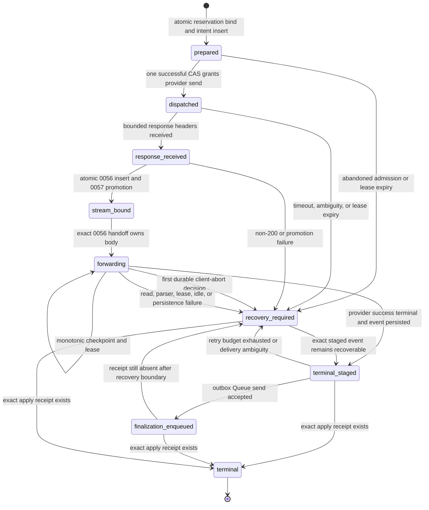

# Ordinary HTTP SSE Durable Terminal Handoff v1 With 0058 Client-Abort Watchdog

Date: 2026-07-22

Status: implemented and locally verified, default-off in every tracked
environment. It authorizes no remote migration, staging traffic, customer
traffic, production cutover, or Go/VPS shutdown.

## Purpose

Paid HTTP SSE cannot rely on an isolate-local cloned response body to finish
billing after client delivery begins. The client, provider stream, Worker
isolate, Queue acknowledgement, D1 write, and reservation lease can fail at
different points. This design gives one provider attempt a durable pre-dispatch
D1 intent, a response-bound handoff, bounded checkpoints, an immutable
finalization event, a leased outbox, and an exact apply receipt.

The safety objective is:

- one provider attempt per admitted reservation generation;
- one frozen billing contract and selected channel/group identity;
- monotonic, bounded terminal evidence without request or response bodies;
- one receipt-bound financial terminal, even when Queue delivery is ambiguous;
- explicit `recovery_required` when success cannot be proven; and
- no automatic provider resend from recovery.

This is for ordinary Worker HTTP SSE only. Container `stream:true`, WebSocket
Realtime, async task polling, and Go/VPS process drain have separate ownership
contracts.

## Components

| Component | Responsibility |
| --- | --- |
| Relay dispatch path | Prepare the exact transformed request, atomically bind the reservation to one `prepared` intent, grant one provider send by CAS, and conservatively recover every ambiguous outcome |
| `relay_http_stream_dispatch_intents` | Freeze pre-dispatch identity and deadlines; prove `prepared -> dispatched -> response_received -> stream_bound` or atomically fence billing into `recovery_required` |
| Relay response path | Atomically create the 0056 handoff and promote the matching 0057 response before the first client byte, then expose one instrumented upstream stream |
| Incoming request watchdog | Synchronously arm the `Request.signal` listener before returning the response; persist a first-wins client-abort decision without refund or resend |
| `relay_http_stream_client_abort_events` | Append-preserve the exact reservation/owner/attempt/provider-operation/Worker-version identity and signal observation time |
| SSE accumulator | Incrementally inspect bounded lines, classify provider terminal success/failure, and retain only normalized usage counters |
| `relay_http_stream_handoffs` | Freeze identity, owner and attempt generation, checkpoint counters/digest, terminal evidence, outbox lease, and recovery state |
| `relay_http_stream_finalization_receipts` | Append-preserved proof that the exact finalization event was applied to the exact reservation generation |
| `BILLING_QUEUE` | Deliver the already frozen finalization event; it does not recompute pricing or authorize another provider call |
| Scheduled Worker | Sweep expired dispatch intents and forwarding leases, lease due outbox work, retry with a bounded backoff, dead-letter without changing event identity, and reconcile exact receipts |

Migration `0056_relay_http_stream_handoffs.sql` remains the response-after
handoff contract. Migration `0057_relay_http_stream_dispatch_intents.sql`
closes the provider-dispatch-to-handoff crash window. Migration
`0058_relay_http_stream_client_abort_watchdogs.sql` remains the SSE
downstream-cancellation ownership head. It was the source-tree D1 head at the
58-migration/66-table/848-column/97-index checkpoint. The following 0059
checkpoint was 59/68/899/100. The current global D1 head is
`0060_relay_container_ring_transition_authority.sql`: 60 migrations, 69
required tables, 909 checked incremental columns, and 101 key indexes.
Migrations 0059/0060 do not change this SSE protocol.

## Runtime Gates

All four variables are exact-string booleans and are tracked as `false` in the
default, staging, and production Wrangler environments.

| Variable | Meaning |
| --- | --- |
| `RELAY_HTTP_STREAM_DURABLE_HANDOFF_ENABLED` | Allows a positive paid SSE request to enter the durable producer path |
| `RELAY_HTTP_STREAM_DURABLE_HANDOFF_STAGING_VERIFIED` | Independent approval latch required by producer, outbox, and recovery paths |
| `RELAY_HTTP_STREAM_OUTBOX_ENABLED` | Allows scheduled leasing and Queue delivery of staged finalization events |
| `RELAY_HTTP_STREAM_RECOVERY_ENABLED` | Allows lease-expiry sweep and receipt reconciliation |

Producer admission requires all four gates, the billing Queue binding, Worker
version metadata, migrations 0056/0057/0058 readiness, and an active positive billing
reservation. A requested producer with missing staging approval fails closed.

Outbox and recovery are deliberately independent from the producer gate. After
producer rollback, operators may keep the staging approval plus outbox and
recovery gates enabled to drain rows that were already created. They still
cannot run without the staging approval latch.

## Durable State Machine



`terminal` is not permitted merely because a reservation looks settled. The
financial-terminal trigger requires an append-preserved receipt whose event ID
and SHA-256 match the handoff, whose reservation and owner generation match,
and whose audit-log finalization event exists. Applying a Queue event uses one
D1 batch to create the receipt and perform the terminal transition.

## Persisted Evidence

The dispatch intent persists only:

- reservation key, pre-bind/current owner generation, attempt generation,
  channel, group, expression hash, and selected time;
- domain-separated provider operation ID, exact transformed-request SHA-256,
  endpoint path, transport kind, Worker version, and frozen billing-snapshot
  SHA-256;
- non-renewable hard deadline, bounded lease, dispatch/response timestamps,
  HTTP status, and a write-once hash of any upstream request ID; and
- recovery reason/time or the exact handoff-bound timestamp.

The handoff persists only:

- reservation key, owner generation, attempt generation, channel, group, and
  expression hash;
- domain-separated provider operation ID, Worker version ID, and frozen
  billing-snapshot SHA-256;
- monotonic checkpoint sequence, chunk/byte counts, normalized usage counters,
  rolling stream SHA-256, and reservation-bounded lease expiry;
- terminal kind/reason/time and immutable finalization event ID, JSON, and
  SHA-256;
- outbox availability, lease token/generation/expiry, attempt count, delivery
  status, and bounded error code; and
- recovery and exact finalization-apply timestamps.

The finalization event is capped at 64 KiB and outbox errors at 4 KiB. Request
bodies, prompts, response bodies, raw SSE frames, provider credentials, client
credentials, Cloudflare credentials, cookies, and raw account/resource IDs are
forbidden from the operational tables and evidence.

The 0058 abort table stores no body, header, frame, credential, free-form abort
reason, or client network identity. Its seven fields bind only the existing
durable operation identity, signal contract version, and observation time.

## Invariants

1. Identity fields and frozen billing hashes never change after insert.
2. Admission binds the reservation and inserts `prepared` in one D1 batch.
   Only one successful `prepared -> dispatched` CAS may poll the provider
   future; replay, timeout, and ambiguous D1 results never authorize a send.
3. The first durable version permits exactly one provider attempt. After
   dispatch it disables channel retry, model fallback, and AI Gateway direct
   fallback.
4. A 0056 insert is accepted only for the exact 0057 `response_received` row;
   its AFTER trigger promotes that row to `stream_bound` in the same SQLite
   transaction. Exact handoff replay is read as success, never re-dispatched.
5. A request-path replay of an existing handoff cannot own another client
   stream.
6. Every checkpoint and terminal transition compares reservation owner
   generation and stream attempt generation.
7. Checkpoint sequence, chunks, bytes, usage counters, and lease expiry are
   monotonic. Usage regression is rejected by SQL and a D1 trigger.
8. A stream handoff cannot extend past either the matching reserved billing
   lease or the immutable dispatch hard deadline.
9. Terminal event ID, JSON, and hash are write-once. Dead-letter processing
   changes only delivery/recovery fields.
10. Outbox claim is one `UPDATE ... RETURNING` lease operation. Delivery,
   retry, and dead-letter writes compare the returned lease generation/token.
11. Queue acknowledgement is not financial truth. Only the exact D1 apply
   receipt permits `terminal`.
12. Dispatch recovery and billing recovery are one guarded SQLite transition.
   Recovery never dispatches or retries the provider request and never reads
   mutable pricing.
13. Stream usage parse failure ignores partial usage and settles only at the
    already approved frozen reserve for both tiered and flat billing modes.
14. The first durable decision wins the provider-terminal/client-abort race.
    An abort recorded while `forwarding` makes `recovery_required/
    client_disconnected` terminal for that handoff; an already staged provider
    terminal is never overwritten by a later abort event.

## Request Path

1. Complete authentication, channel selection, billing pre-consumption, and
   every fallible local request transform before provider I/O.
2. For a positive paid stream, require the complete durable gate set, billing
   Queue, Worker version metadata, and 0056/0057/0058 schema before any send.
3. Freeze the exact transformed request SHA-256, transport/route identity,
   120-second response-header limit, and 900-second hard stream deadline. The
   configured hard cap is 3600 seconds. When this durable path is enabled, the
   generic 3600-second reservation lease is capped to the 900-second deadline.
4. In one D1 batch, bind the reservation to the selected channel/group and
   insert attempt generation one as `prepared`.
5. CAS `prepared -> dispatched`. Poll the provider future only when the CAS
   returns `Applied`; all other results fail closed without a send.
6. Record the response status and hashed upstream request ID. A transport
   error, timeout, or any non-200 response atomically moves both dispatch and
   billing reservation to `recovery_required`; it is never retried or refunded
   automatically.
7. For HTTP 200, insert the exact 0056 `forwarding` handoff. The 0057 AFTER
   trigger changes `response_received -> stream_bound` in the same transaction
   before any client body byte can be released.
8. Return a response backed by one instrumented stream. Every chunk is hashed
   and parsed once before being yielded to the client. Before returning the
   response, synchronously install an incoming `Request.signal` listener and
   schedule its bounded D1 watchdog with `waitUntil()`.
9. Checkpoint after 16 chunks, 64 KiB, or a lease-heartbeat boundary. Renew the
   billing lease first and cap the handoff lease at the hard deadline.
10. On provider-confirmed successful terminal, create the audit plus billing
   finalization event, persist its immutable JSON/hash with the final
   checkpoint, and only then release the terminal chunk.
11. The scheduled outbox sends the persisted event. The Queue consumer applies
   existing idempotent billing logic, writes the audit event and exact receipt,
   and transitions the handoff to `terminal`.
12. On client disconnect, append the exact 0058 event and atomically change a
    matching `forwarding` handoff to `recovery_required/client_disconnected`.
    Retry the D1 write at most three times in the current invocation; never
    resend or refund. Provider terminal or recovery paths disarm only after
    durable state proves the stream is no longer `forwarding`.

A provider `response.failed` or `response.incomplete` terminal is not treated
as billable success. It checkpoints what was observed, moves to
`recovery_required` with `provider_error`, and requires an explicit recovery
policy.

## Failure Matrix

| Failure | Current convergence | Promotion requirement |
| --- | --- | --- |
| Local preparation fails before admission | No dispatch row and no provider poll; normal reservation recovery owns it | Staging zero-call proof |
| Crash after `prepared`, before dispatch CAS | Expired-intent sweep atomically moves intent and billing to recovery; no provider send was authorized | Restart plus provider counter proof |
| CAS result is lost or process dies around dispatch | `dispatched` is treated as provider-ambiguous; recovery never resends or refunds automatically | D1 response-loss and provider-counter proof |
| Provider headers exceed 120 seconds | Provider future is abandoned and dispatch plus billing enter recovery | Real delayed-header and cancellation proof |
| Provider returns any non-200 | Status is retained; dispatch plus billing atomically enter recovery with no retry/fallback | Provider-family status and invoice reconciliation |
| 0056 insert or 0057 promotion fails before first byte | One SQLite transaction leaves no partial handoff/promotion; request fails closed into recovery | Statement fault injection and zero client-body proof |
| Stream read, parser bound, or idle timeout | Generation-fenced `recovery_required`; no provider resend | Real Workerd plus staging fault proof |
| Hard deadline reaches 900 seconds | Active stream records `worker_termination/stream_total_deadline_exceeded`; leases cannot cross the deadline | Periodic-chunk and scheduler takeover proof |
| Provider failed/incomplete terminal | Checkpoint then `recovery_required/provider_error` | Approved billing policy and invoice reconciliation |
| EOF without provider terminal | Client stream errors and row becomes recovery-required | Provider-family fixtures proving terminal classification |
| Terminal event D1 write fails | Client terminal is not released; recovery-required is attempted | D1 ambiguity and restart proof |
| Queue send accepted but local mark fails | Event can redeliver; immutable event and receipt make apply idempotent | Real Queue acknowledgement ambiguity drill |
| Queue retries exhausted | Delivery is dead-lettered without event replacement; row remains recoverable | Alert, operator replay, and retention drill |
| Apply succeeds but response/ack is lost | Exact receipt reconciliation transitions to terminal | Queue redelivery plus D1 receipt proof |
| Client stops pulling or cancels | Incoming `Request.signal` appends 0058 evidence and atomically owns recovery; lease sweep remains the fallback if the bounded write cannot complete | Local reader-cancel/service-binding pass plus remote HTTP/2, HTTP/3, D1-fault, restart, and WFP evidence |
| Worker restart | D1 state survives; outbox/recovery resume only under drain gates | Real restart/version-skew campaign |

## Ordinary HTTP SSE Single-Forwarding Closure

The durable-disabled ordinary HTTP SSE path now uses the same response-owned,
pull-driven shape required by this handoff design. It no longer uses
`Response::cloned()`, `Response.clone()`, or a tee to let audit work consume the
provider body independently. Each downstream pull advances at most the bounded
stream machinery needed to read, parse, account, and yield the next provider
chunk. Provider terminal ownership is synchronously claimed and registered as a
short-lived `waitUntil` finalization task before the terminal outcome is yielded,
so response cancellation cannot drop that in-flight Queue/D1 work. A separate
`Request.signal` listener and stream-drop fallback may claim ownership only while
it is still pending, then register their own short finalization task. The lease
heartbeat uses one cancelable timer and one short renewal task at a time; it
cannot read or buffer the body and does not keep a response-lifetime `waitUntil`.

The local Workerd slow-consumer fixture offers 256 provider chunks. After one
client read and a 300 ms pause, the provider is incomplete and has been pulled
no more than eight times. Releasing the provider terminal and draining the
client advances the source by at most one additional pull, keeps total pulls
below 256, and converges positive upstream usage through the billing Queue with
`provider_terminal_event`. Source mutation audit separately rejects moving
financial finalization back into the cancelable pull future. This closes the
local clone/tee and bounded-provider-
read blockers. It does not prove real Cloudflare HTTP/2, HTTP/3, or TCP
disconnect propagation.

Accepted patterns are one response-owned pull-driven stream, bounded
incremental usage/digest state, synchronous provider-terminal registration as a
short-lived `waitUntil` task, an event-triggered first-owner client-abort path, a
non-consuming single-timer heartbeat, and frozen-reserve cancellation.
Rejected patterns are response cloning/teeing, detached body consumption,
unbounded eager buffering, partial-usage charging after ambiguous disconnect,
automatic refund/resend, and treating a local reader cancel as remote network
evidence.

## Rollout

### S0: Security And Candidate Freeze

- Revoke the exposed Cloudflare credential. Never use it for readback or
  mutation.
- Issue separate least-privilege deploy and readback identities through the
  approved secret workflow.
- Freeze Rust commit, Worker version, schema digest, billing Queue binding,
  migration inventory, rollback artifact, and Go/VPS authority state.

### S1: Reader-First Schema Expand

- Keep all four handoff gates false.
- Back up isolated staging D1 and prove old-writer plus active-operation drain.
- Prove every 0056 producer is disabled before applying 0057. An N-1 reader may
  remain, but an N-1 producer cannot create a handoff after the new guard exists.
- Apply ordered migrations through 0058.
- Read back 58 migrations, 66 tables, 848 checked incremental columns, 97 key
  indexes, all 0056 objects, the 0057 table/two indexes/ten triggers, and the
  0058 table/index/five triggers/seven exact columns.
- Run immutable identity, monotonic usage, event replacement, receipt
  prerequisite, receipt mutation/delete, terminal prerequisite, dispatch CAS,
  atomic promotion/recovery, deadline, and business-fingerprint negatives.

### S2: Reader Deployment And Drain-Only Rehearsal

- Deploy the exact reader/runtime while producer remains false.
- Prove N-1 binaries tolerate the expanded schema as readers and cannot regain
  producer authority. Retain the N candidate for 0057 drain and recovery.
- With synthetic seeded rows only, set staging approval plus outbox/recovery
  true and prove drain-only behavior. Then return every gate to false.

### S3: Isolated Synthetic Producer Canary

- Use no customer traffic and a provider account with an independent call
  counter.
- Enable staging approval, outbox, recovery, and producer in that order for a
  tiny bounded cohort.
- Prove one provider operation, monotonic checkpoints, terminal-event-before-
  client-terminal ordering, one billing terminal, one audit event, and one
  receipt per reservation.
- Hold a slow reader after its first chunk and prove bounded provider pulls and
  memory before releasing the provider terminal; then prove upstream usage,
  Queue settlement, and provider-terminal convergence.

### S4: Faults, Soak, Cost, And Rollback

- Run every failure-matrix row across N and N-1 Worker versions.
- Observe forwarding, staged, leased, retry, dead-letter, recovery-required,
  receipt, and terminal age/cardinality metrics for the approved window.
- Reconcile provider invoices/call counters, D1 billing rows, audit logs,
  request counters, and Go/VPS comparison exports.
- Rehearse producer-off rollback while drain gates remain on, then prove no
  active/staged/leased row remains before turning drain gates off.

### S5: Promotion Review

Promotion requires the existing P5 packet, security/privacy review,
performance/cost/SLO evidence, rollback owner sign-off, billing owner sign-off,
and migration owner sign-off over one immutable candidate. Local test output
alone cannot satisfy S5.

## Rollback

1. Disable `RELAY_HTTP_STREAM_DURABLE_HANDOFF_ENABLED` first to stop new rows.
2. Keep staging approval, outbox, and recovery enabled while any nonterminal,
   staged, due, or leased row exists.
3. Route the cohort back to hot Go/VPS authority. Do not resend ambiguous Rust
   provider operations.
4. Reconcile every reservation, receipt, audit event, request counter, and
   provider call before disabling drain gates.
5. Do not restore response clone/tee as a rollback shortcut. If the exact
   single-forwarding artifact cannot remain active, route new SSE traffic to
   hot Go/VPS while the N drain worker owns existing durable rows.
6. Retain migrations 0056/0057/0058, all rows, receipts, logs, and candidate evidence.
   Never down-migrate or delete handoff evidence during an incident.
7. Do not re-enable an N-1 durable producer on the 0058 schema. A code rollback
   routes new traffic to Go/VPS while the N drain worker owns existing rows.
8. Disable outbox/recovery only after the approved zero-backlog and retention
   checks pass.

## Local Verification

The implementation increment includes:

```powershell
cargo fmt --all --check
cargo test -p cinatoken-worker --lib
cargo test --workspace --exclude cinatoken-worker
cargo check -p cinatoken-worker --target wasm32-unknown-unknown
python tools/verify_sqlite.py
bun run check:d1:migration-config
bun run check:relay-http-stream-handoff:config
bun run check:do-lifecycle-runtime
bun run check:relay-container:p5-evidence
bun run check:relay-container:p5-foundation
bun run check
```

The focused Workerd cases execute concurrent dispatch authorization with
exactly one successful CAS, dispatch-to-recovery with atomic billing fencing,
response-to-handoff atomic promotion, forwarding checkpoints, usage-regression
rejection, terminal staging, outbox leasing, receipt-bound convergence, and
receipt-delete rejection against real local D1. The 0058 case additionally
routes through an isolated gate-enabled Worker service binding, reads one real
SSE chunk, cancels the response reader, observes the incoming `Request.signal`,
and proves one provider call plus durable abort evidence with no settle/refund.

The ordinary-path slow-consumer case additionally reads one chunk from a
256-chunk pull-generated provider response, pauses for 300 ms, and observes at
most eight provider pulls with no provider terminal. Controlled terminal
release plus client drain advances at most one additional pull and converges
upstream usage, billing Queue settlement, request accounting, and the
`provider_terminal_event` completion reason.

The complete local source checks pass Worker unit tests 858/858, all remaining
Rust workspace tests, Worker Wasm build/check, SQLite 58/66/848/97, both
configuration audits, P5 evidence/foundation 68/68, direct D1 abort-race tests,
the complete Workerd lifecycle 52/52, and `bun run check` in 845.2 seconds.
These results bind local source behavior only and do not replace staging or
production evidence.

## Open Production Blockers

- Incoming `Request.signal` and the durable watchdog are proven locally through
  Workerd service binding and response-reader cancellation, but not on real
  Cloudflare HTTP/2, HTTP/3, client TCP loss, WFP chaining, isolate termination,
  or version-skew paths.
- The durable-disabled SSE clone/tee and bounded-provider-read blocker is
  closed locally. Real edge disconnect propagation and transport-level
  cancellation remain part of the remote HTTP/2, HTTP/3, TCP, Gateway, and WFP
  campaign; local reader cancellation is not a substitute.
- Real before-header, client-abort, D1 ambiguity, Queue acknowledgement
  ambiguity, restart, and version-skew campaigns are not archived.
- Provider-family failed/incomplete terminal billing policy is not approved.
- Remote migration 0058 apply/readback and all P5 evidence are absent.
- The exposed credential has not been proven revoked/rotated in this task.
- Go/VPS drain, reverse synchronization, canary, and rollback evidence are
  absent.

Go/VPS remains authoritative. Production remains **NO-GO**.
